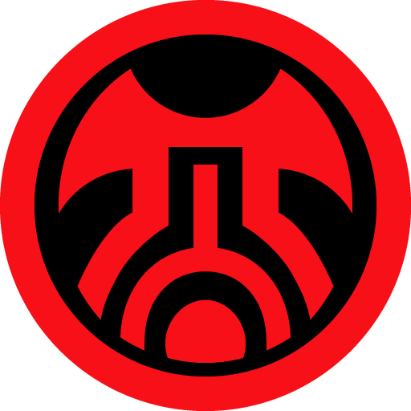
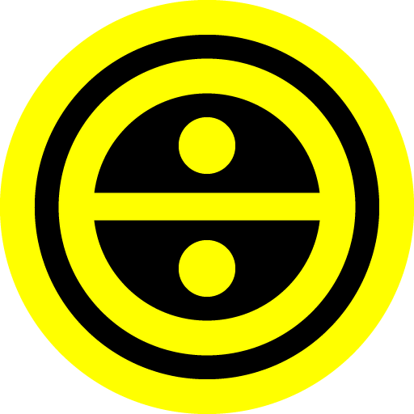
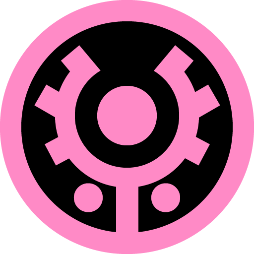

## EP1

| 区域  | ID                                                                                                                                                                                                                                                                |
|-----|-------------------------------------------------------------------------------------------------------------------------------------------------------------------------------------------------------------------------------------------------------------------|
| 森林  |                                                                                                                              |
| 洞窟  |  |
| 坑道  |                                                             |
| 遗迹  |     |

| 区域  | ID                                                                                                                                                                                                      |
|-----|---------------------------------------------------------------------------------------------------------------------------------------------------------------------------------------------------------|
| 神殿  |    |
| 宇宙船 |  |
| 中管  |    |
| 海底  |    |
| 塔   |    |

## EP4

| 区域 | ID  |
|---|-----|
| 陨石坑 |    |
| 沙漠 |   |

