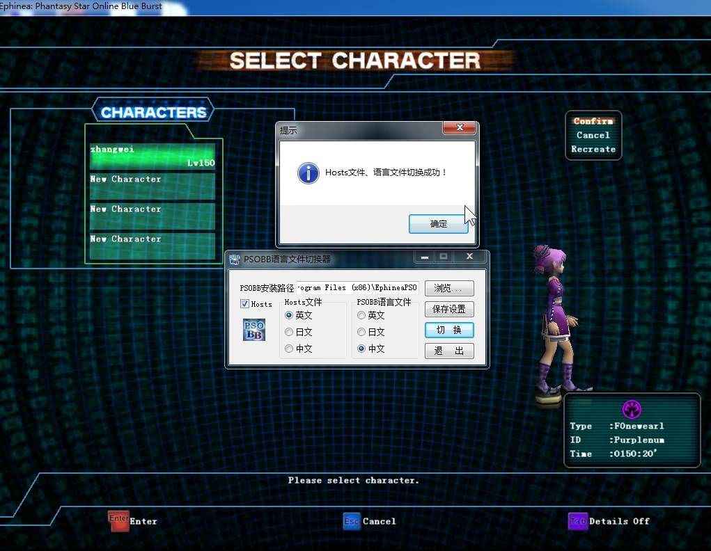
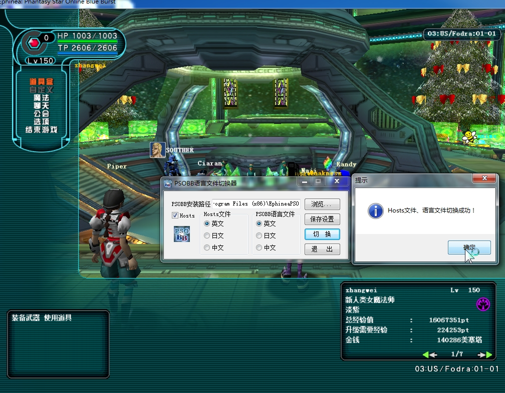

# 下载汉化软件包

**QQ群(956652396)共享中下载`PSOBB语言切换器`，然后运行。。。，选择PSOBB
安装路径，放到游戏根目录也需要选择。**

# 切换汉化时机-必须操作

  

**在`选择角色`界面需要切换为`中文`。**

# 切换原版时机-必须操作

 **当角色成功登录到`大厅`，汉化文件已经加载完成，此时需要切换为`英文`，  
因每次登录，服务器都换验证本地资源文件，不一致强制更新。**
