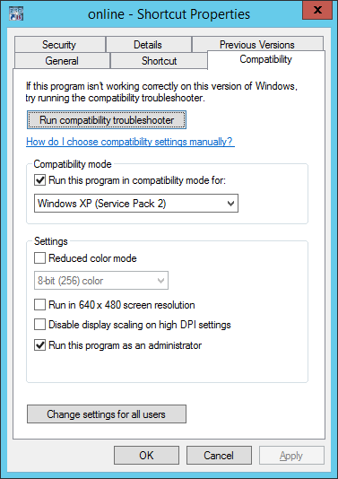
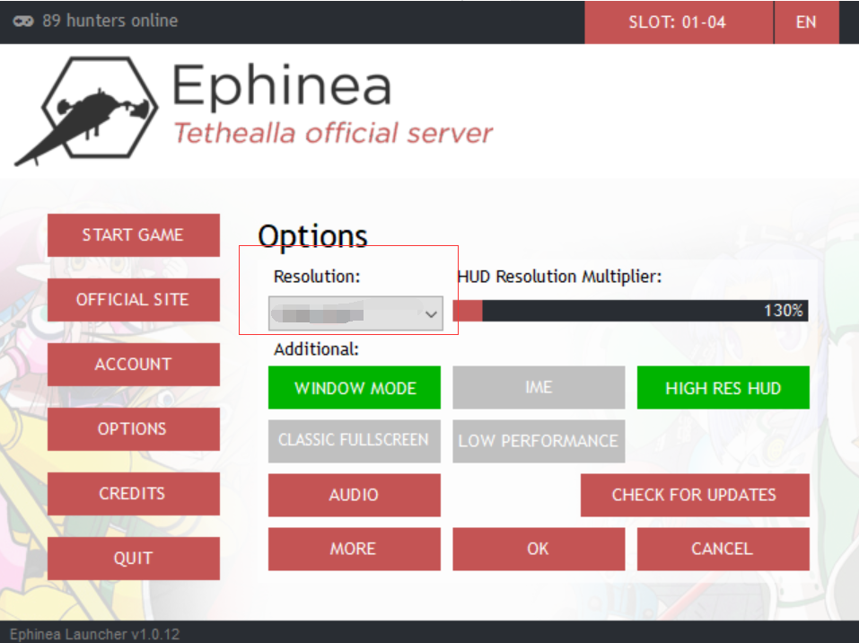
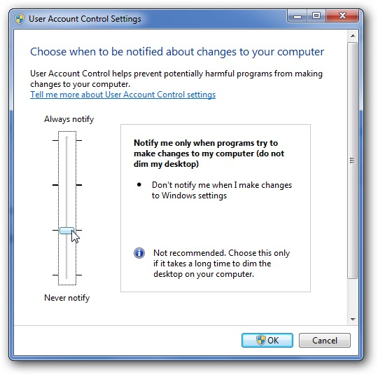
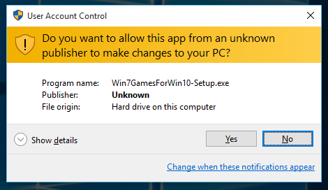
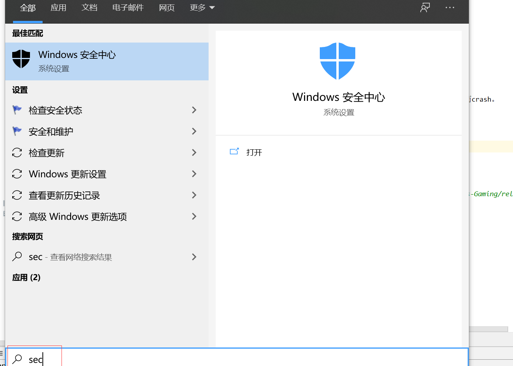
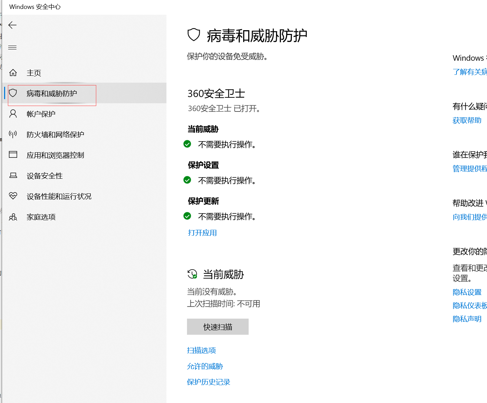
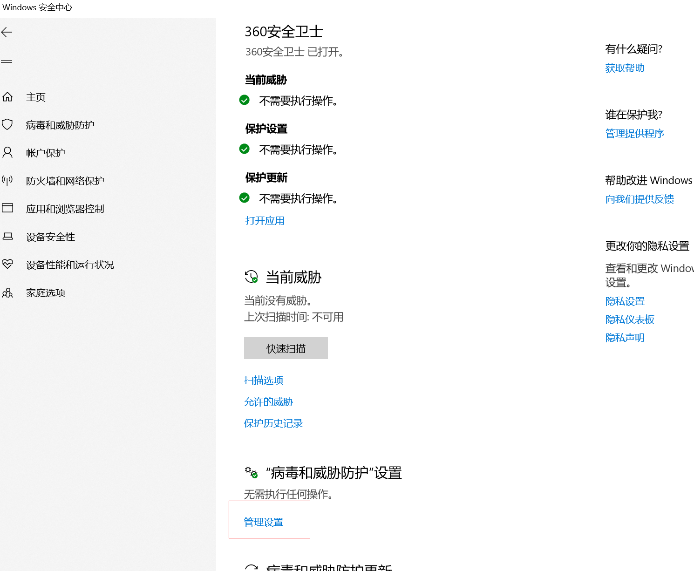
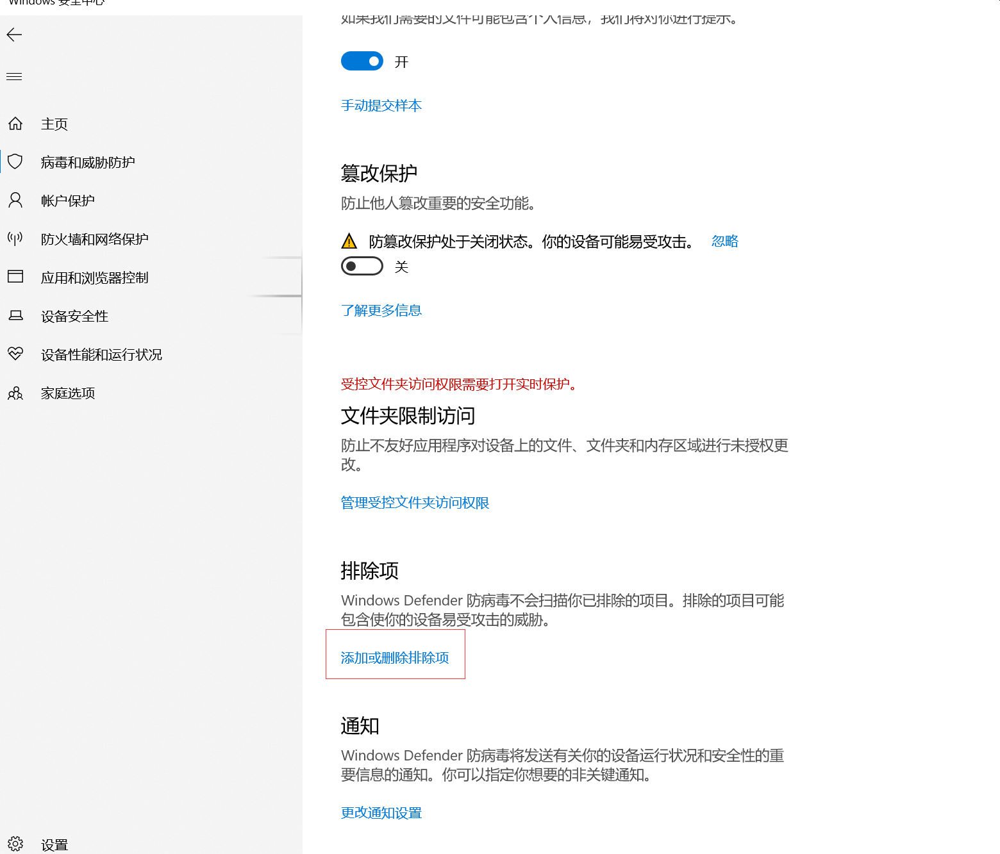
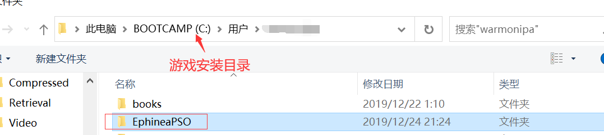

# 设置windows dep

  

右键单击桌面上的“计算机”图标，选择“属性”，在打开的“系统”窗口中点击  
“高级系统设置”链接  打开“系统属性”面板。在“高级”选项卡页面中的  
“性能”下点击“设置”打开“性能选项”面板。  点击“数据执行保护”选项卡，  
在该页面中我们可确认自己  计算机的处理器是否支持DEP。  如果支持会在底部的一行显示    
“你的计算机处理器支持基于硬件的DEP。”，反之会显示“你的计算机处理器  
不支持基于硬件的DEP，不过,Windows能使用DEP软件防止一些类型的攻击。”

# 设置兼容性

右键游戏快捷方式，切换到``兼容性选项卡`,  
勾选\[√\] Run this programe in compatibility mode for:  
并选择 Windows XP(Service Pack2)

# 设置登录器的分辨率

若前两步都设置之后还是出现闪退的情况，请调整`分辨率`,  
根据当前电脑显卡和显示器的情况选择合适的分辨率，根据以往经验，  
选择高分辨率不一定卡，选择低分辨率不一定不卡，哈哈哈......

# 设置用户账户控制(UAC)
  
设置到这个级别之后，打开其他带有`执行保护窗口`的程序时，psobb游戏不会丢失渲染而crash。  
。

# 添加游戏目录为杀毒软件**白名单**
遇到游戏窗口左下角有`DLL ERROR`和`Error 916`等错误，需设置杀毒软件白名单。

1. Window开始菜单输入 `sec`，打开  
  

2. 选择`病毒和威胁保护`  
 
 
3. 打开`管理设置`
  

4. 打开`添加或删除排除项`
  

5. 添加游戏根目录
  
  

至此，游戏目录添加杀毒软件白名单完成。

# 全屏游戏神器
使用游戏本身自带的全屏设置时，经常会被其他程序弹出的小窗口意外丢失渲染而crash。
这里推荐一款全屏神器[BorderlessGaming](https://github.com/Codeusa/Borderless-Gaming/releases/download/9.5.6/BorderlessGaming9.5.6_admin_setup.exe)
此程序完全修复了上面的问题!

