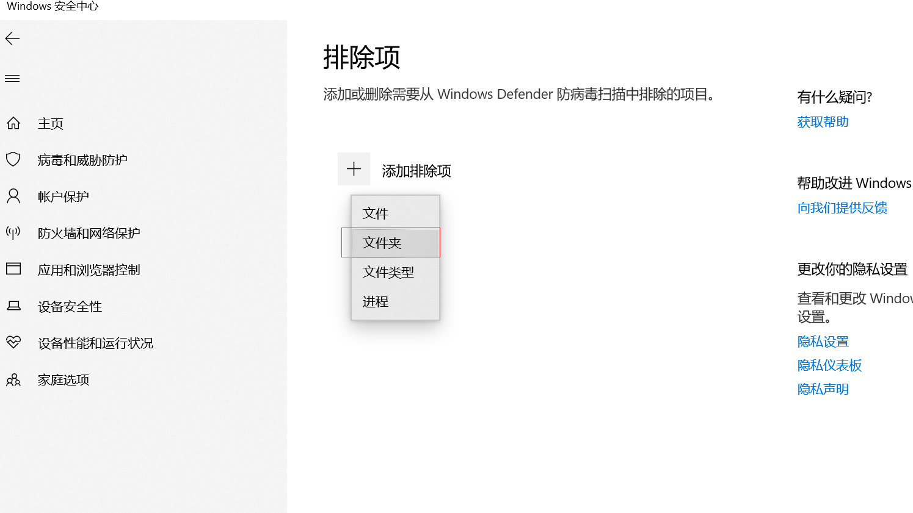

# 设置 Windows DEP

1. 右键桌面上的 **计算机** 图标，选择 **属性**。
2. 在打开的 **系统** 窗口中点击 **高级系统设置**。
3. 在 **系统属性** → **高级** → **性能** 区域中点击 **设置**。
4. 在 **性能选项** 中切换到 **数据执行保护** 标签页。

在这里可以确认处理器是否支持 DEP：

* 若支持，会显示：**你的计算机处理器支持基于硬件的 DEP。**
* 若不支持，会显示：**你的计算机处理器不支持基于硬件的 DEP，不过 Windows 仍可使用 DEP 软件防止部分攻击类型。**

---

# 设置兼容性

1. 右键游戏快捷方式，选择 **属性**。
2. 切换到 **兼容性** 标签页。
3. 勾选 **Run this program in compatibility mode for:**
4. 选择 **Windows XP (Service Pack 2)**。

---

# 设置登录器分辨率

如果前两步完成后仍然出现闪退，请尝试调整 **分辨率**。
根据显卡与显示器情况选择合适分辨率即可：

> 选择高分辨率不一定卡，选择低分辨率也不一定不卡——按实际效果为准。

---

# 设置用户账户控制（UAC）

将 UAC 调整到下图所示级别后，当其他程序弹出“执行保护”窗口时，
PSOBB 不会丢失渲染而导致崩溃。

---

# 将游戏目录添加到杀毒软件白名单

遇到游戏左下角提示 `DLL ERROR` 等问题时，请按以下步骤操作：

1. 在开始菜单输入 **sec** 并打开
   

2. 进入 **病毒和威胁防护**
   

3. 打开 **管理设置**
   

4. 点击 **添加或删除排除项**
   

5. 将 **游戏根目录** 添加为排除项
   
   

至此，游戏目录白名单配置完成。

---

# 全屏游戏推荐工具

使用游戏自带全屏模式时，可能因其他程序弹窗导致渲染丢失并 crash。

推荐使用 **Borderless Gaming**：

> 无边框窗口化全屏，能有效避免上述问题。

下载地址：
[BorderlessGaming 9.5.6](https://github.com/Codeusa/Borderless-Gaming/releases/download/9.5.6/BorderlessGaming9.5.6_admin_setup.exe)
