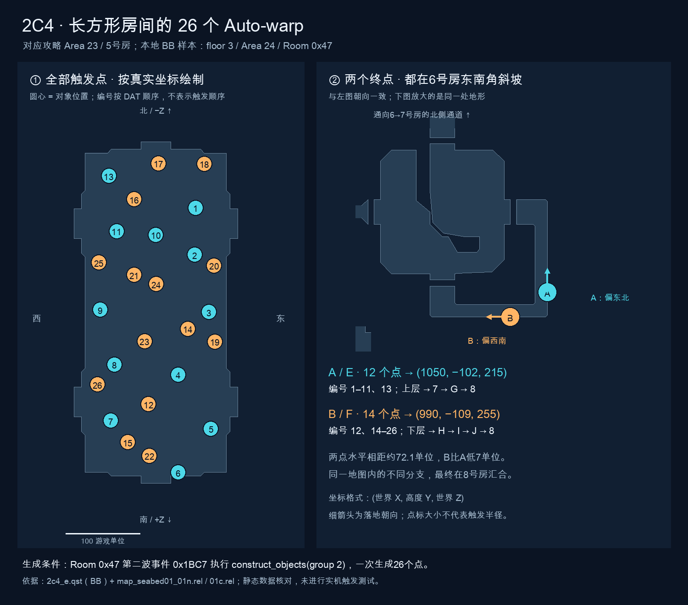
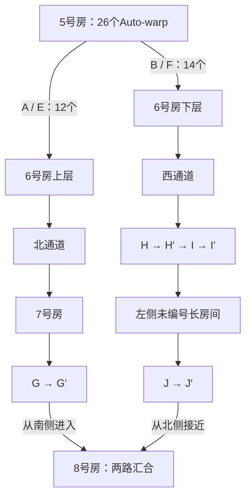

# 2C4 长方形房间：Auto-warp 点位与后续分支

## 来源与用途

本记录从 `pso-quest-master` 提交 `a2194c4` 同步，用于本站 Challenge 攻略维护。
[源文档及版本](https://github.com/warmonipa/pso-quest-master/blob/a2194c4/knowledge/20-2c4-auto-warp-branches.md)。
特写图、标记解释和分支对比已整理到本站 `guide/ep2ch.html#area-23-branches`，维护者已于 2026-09-21 验收并授权提交推送。线上发布结果以该提交的 Pages 工作流为准。

## 结论

攻略 Area 23 的 **5号长方形房间共有26个 auto-warp：青色 A 组12个，橙色 B 组14个**。本文的 A/B 是分析图中的分组名称，对应原攻略的 **E/F**，不要与攻略其他房间的 A/B 传送器混淆。

两组传到6号房不同位置，顺路前进会进入不同分支，最终在8号房汇合。推荐按攻略全队贴5号房西墙中段，走 A/E 主线；它避开 B/F 支线的 Delbiter 房。这里没有实机计时结果，不能据此声称 A 一定最快，或 B 的怪物总数更多。

## 放大图与全部点位



[SVG矢量放大图](../assets/img/challenge/ep2/auto-warp-map.svg) · [全部26点的坐标与对象ID](assets/2c4-auto-warp/auto-warp-points.json)

### A/E、B/F 是什么意思？

它们是两套图示标记的对应写法，不是地图上的“AE”“BF”标识，也不是连续经过 A 再到 E、B 再到 F：

- **A/E**：特写图的青色 A 组，对应攻略地图5号房的 **E**，传送到6号房的 **E′**。
- **B/F**：特写图的橙色 B 组，对应攻略地图5号房的 **F**，传送到6号房的 **F′**。

地图上的撇号表示对应的传送落点。攻略正文直接称为 **E 路线、F 路线**；地图2号房附近另有 A/B 传送标记，与特写图的 A/B 分组无关。

| 分组 | 原攻略字母 | Auto-warp 数量 | 图中编号 | 世界落点 (X, Y, Z) | 落地朝向 |
|---|---|---:|---|---|---|
| 青色 A | E → E′ | **12** | 1–11、13 | (1050, -102, 215) | 0x8000，−Z（北） |
| 橙色 B | F → F′ | **14** | 12、14–26 | (990, -109, 255) | 0xC000，−X（西） |
| 合计 | | **26** | 1–26 | | |

- 图中圆心是对象位置；圆形大小不代表触发范围，编号不表示触发顺序。
- 坐标中的 Y 为高度。以世界 −Z 为北、+X 为东，与攻略图朝向一致。
- A 位于6号房东南侧外围 L 形斜坡的东侧竖段；B 位于南侧横段。两点水平相距约72.11单位，B的配置高度低7单位。
- 两点都在当前地图内，没有跨楼层传送；这不意味着它们的后续路线相同。
- 碰撞地形中，两点均落在第145号（从0起）mesh 的可行走三角形内。插值地面高度分别约为 -102.944、-109.476，与配置位置相符。

## 两条后续路线

6号房有高低差及分隔。按落地朝向顺路前进：A 走东侧上层与北门，B 走南侧下层与西门。以下比较正常前进路线，不声称落点永久锁定路线，也不排除回头换线。



| 比较范围：离开6号房后、到8号房汇合前 | A/E 分支 | B/F 分支 |
|---|---:|---:|
| 章鱼（Dolmolm / Dolmdarl合计） | 4 | 0 |
| Deldepth | 3 | 3 |
| Sinow Zoa | 2 | 2 |
| Delbiter | 0 | 1 |
| **主战斗链合计** | **9** | **6** |
| 另有 Recobox 配置记录 | 6 | 4 |
| **含 Recobox 的配置记录总数** | **15** | **10** |

上述数量不包含公共6、8号房；Recobox不一定全部必杀，其产生的 Recon 也不计入表内。不要把配置总数当成必杀数或最终击杀统计。

### A/E：经7号房的主线

7号房内部 Room `0x14` 的主事件链为：

1. `0xC9`：4只章鱼。
2. `0x7DB`：2只 Deldepth。
3. `0x7DC`：1只 Deldepth＋2只 Sinow Zoa；完成后开启包括 `0x19` 在内的门开关。

另有独立事件 `0xCA` 的3条 Recobox 记录，以及北通道 Room `0xD5` / 事件 `0x853` 的3条 Recobox 记录。攻略要求清掉通道最后一个挡路 Recobox，7号房普通箱可跳过。

西侧 G 传送器为 `K-1CB`，目标 `(750, -90, 995)`，随后从南侧进入8号房。

### B/F：经左侧未编号长房间的支线

H 传送器 `K-1E4` 的目标为 `(-790, -30, -5)`。随后 I 的强制传送对象 `K-24E`、`K-24F`、`K-250` 把玩家送到 `(-790, -61, -275)`，进入内部 Room `0x50`。

该长房间的主事件链为：

1. `0x321`：1只 Delbiter。
2. `0x1F4B`：2只 Sinow Zoa。
3. `0x1F4C`：3只 Deldepth；完成后构造对象组5，生成离开房间的传送对象。

另外，独立事件 `0x322` 对应4条 Recobox 记录；它不在构造离开传送器的主事件链上。

组5中，J 的强制传送对象 `K-246`、`K-247` 指向 `(740, -94, 316)`，从北侧接近8号房。同组普通传送器 `K-244` 另有目标 `(770, -94, 1035)`，不能与叠放的强制传送对象混为同一个目标。

## 5号房传送点的生成条件

全部26个对象均为 `0x02B9 / TObjMapForceWarp`，属于 Room `0x47`、对象组2。

```text
Room 0x47 / wave 1 / event 0x2C7
  → trigger_event 0x1BC7
Room 0x47 / wave 2 / event 0x1BC7
  → construct_objects room=0x47 group=2
  → set_switch_flag 0x79
```

因此这些点由第二波事件的动作流统一生成，不是进房时全部生效。分组取决于各对象的目标坐标与朝向。

## 为什么只比较入口事件会误判

6号房两侧入口的刷怪触发器都引用 `0x259` 和 `0x25A`：

| 入口 | 触发器世界位置 | 引用事件 |
|---|---|---|
| 东侧上层入口 | (981.94, -90, 85.314) | 0x259、0x25A |
| 南侧下层入口 | (879.63, -120, 186.009) | 0x259、0x25A |

两个事件各对应一条 Sinow Zoa 记录，都是位置触发的根事件；wave编号不表示它们必然串行执行。

- `0x259` 完成后设置 `0x15`、`0x14`；北门 `K-1E5` 使用 `0x15`。
- `0x25A` 完成后设置 `0x16`；西门 `K-1E8` 使用 `0x16`。

**入口引用相同事件，不代表门后的路线相同。** 需要继续追门、通道、传送器及下一房间的事件链，才能判断整个分支的战斗负担。

## 样本、地图编号与验证范围

本次使用本地 `phantasmal-world` 测试资源：

```text
psolib/src/commonTest/resources/quests/chl/ep2/2c4_e.qst
SHA-256: b8b545b56484f3d63d80076b9f8b0ccd03b5133bf9a1ab34336c8684117610c2
```

按 **BB_V4** 解码，任务名称为 `Stage4`。脚本把 **floor 3 显示为 Area 24**，地图选择为 `bb_map_designate 3, 0x1C, 0, 1, 0`。攻略将具有该布局的图标为 **Area 23**。本文保留这个编号差异，没有据此断言当前服务器或攻略哪一方编号错误。

地形来自本地 `web/src/jsMain/resources/assets/areas/` 下的：

- `map_seabed01_01n.rel`：房间变换。Room `0x47` 的位置为 `(-80, -60, 925)`，Y旋转为 `0x3FFF`。
- `map_seabed01_01c.rel`：碰撞地形，用于重绘轮廓和核对落点。

对象坐标按所属房间的旋转和平移转换为世界坐标。原始敌人记录中部分 `floor` 字段仍为旧area值 `0x0A`；统计采用外层 `.enemy_sets 3` 的实际楼层归属。类型 `0xE0` 在此海底地图是 Sinow Zoa/Zele，不能套用塔地图的 Epsilon 名称。

已核对26个点的数量、目标分组、位置变换、地面位置、分支传送链、事件链及门开关。分支事件报告没有悬空跳转或指向比较范围外的事件边；其他房间排除于数量比较范围，不表示未部署。

未核对当前服务器下发文件是否与样本相同；未做实机触发范围、跨层捷径、战斗耗时或仇恨测试。

## 参考与本地复核材料

- [PSOHaven EP2 C4攻略](https://www.psohaven.com/guide/ep2ch.html#c4)
- [Ephinea Wiki：Stage 4 / Area 23](https://wiki.pioneer2.net/w/Episode_2:_Stage_4/Guide#Area_23)
- 原攻略布局图：[本站保存的原攻略图](../assets/img/challenge/ep2/original/wiki/2ca23.png)。
- 本地源码参考：`newserv/src/Map.cc`、`phantasmal-world/psolib/.../quest/ObjectType.kt`、`AreaRenderGeometry.kt`、`AreaCollisionGeometry.kt`。
- 原始解码文本、地形绘图脚本、部署清单与刷怪报告保留在源项目本地的 `artifacts/2c4-auto-warp/`（不纳入版本控制）。本站同步的 PNG 和26点JSON位于 `docs/assets/2c4-auto-warp/`；攻略与本文共用的 SVG 已移至 `assets/img/challenge/ep2/auto-warp-map.svg`，随站点构建发布。

## 攻略维护入口

- 地图说明和三语注释源：`content/challenge-maps/ep2.json` 中 `areas["23"]`，现有注释 ID 为 `west-wall-stack`。
- 布局轮廓：`content/challenge-maps/ep2-c4-geometry.json`。
- 三语地图输出：`assets/img/challenge/ep2/maps/{zh,en,ja}/c4_area_23.svg`。
- 攻略页：`guide/ep2ch.html#c4`；对应研究范围是图中5号房及后续 E/F 分支。
- 面向玩家时优先沿用原图 E/F；如采用本图 A/B，必须明确 A=E、B=F，避免与3a/3b前面的 A/B 传送器混淆。
- 更新路径时需区分步行和传送：E′→6上层→7→G，F′→6下层→H→I→左侧长房→J；传送跨越不能绘制成可步行连接。
- 先保留攻略 Area 23 的标号；本地 BB 样本显示 Area 24 的差异属于证据备注，未核对服务器实际下发文件前不要据此重编号站点地图。

## 2026-09-21 攻略验收记录

- Area 23 全图下方新增展开的特写与分支对比，沿用地图查看器的放大、缩小与拖动功能。
- 正文以 E/F 命名路线，解释特写 A/B 与地图 E/F、E′/F′ 的对应关系，并列出路线、主战斗链和另列的 Recobox 数量及统计边界。
- 本次补充的攻略正文及特写为中文；英文、日文界面入口已明确标注中文内容，不表示已完成三语翻译。
- 验证通过：生产构建、24 项地图单元测试、地图资产完整性检查、8 项地图查看器浏览器测试；另在 390px、1440px 下核对新特写加载、放大及页面无横向溢出。`git diff --check` 通过。
- 维护者查看本地预览后明确要求“对齐文档，提交推送”，据此接受本次结果并授权推送到 `origin/master`。
