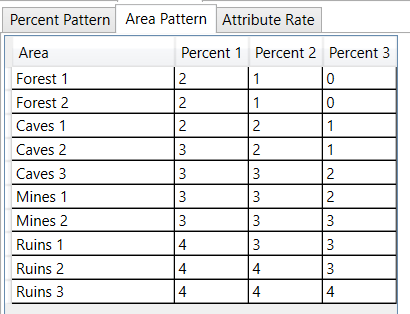
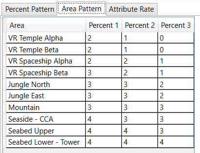

### 属性值信息

* 普通模式会使用Pattern0-4,Pattern5为红盒
* 苦痛模式(Anguish)低级区域使用Pattern3，高级区域使用Pattern4，红盒仍为Pattern5

#### EP1&2&4

### 区域信息

因EP4不存在区域信息，可能沿用EP1或者EP2，待确认

#### EP1

#### EP2

### 属性信息

因EP4不存在属性信息，可能沿用EP1或者EP2，待确认

#### EP1

#### EP2

##### 非金黄

##### 金黄

