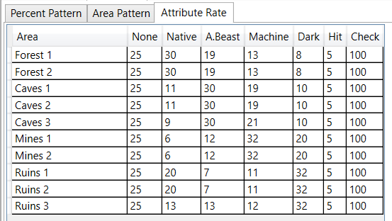
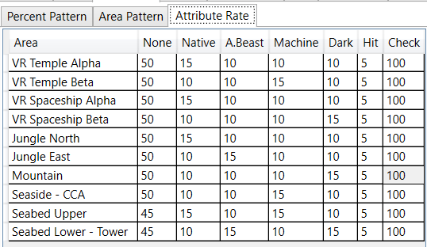
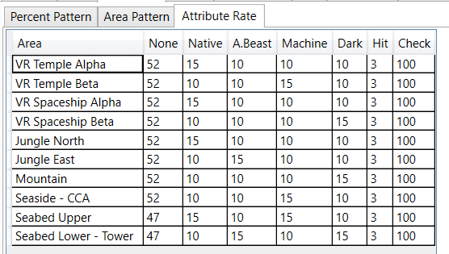
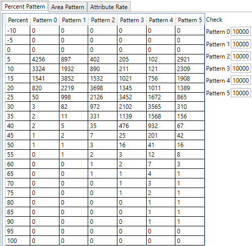

### 属性生成顺序

属性`区域概率` -> 属性`模式`(pattern) -> 属性`值`

### 属性概率信息

在PSO中当武器随机掉落时，最多可以3个属性(银月和太刀最多两个属性)，对于每个属性，游戏会在1到100之间随机一个数值，
用于确定武器获得哪个属性，如果同样的属性随机到了两次，那么这个会被设置为`无属性`，U、VH、H和N的Hit概率近似为5%、3%、2%、1%

#### EP1

#### EP2

#### EP4

### Patterns信息

Pattern N表示不会随机属性

#### N

|                  |         区域         |                 | Patterns |
|:----------------:|:--------------------:|:---------------:|:--------:|
|     森林1     |     神殿Alpha     |        -        |   0 N N  |
|     森林2     |      神殿Beta     |        -        |   0 N N  |
|      洞窟1     |    宇宙船Alpha   |   陨石坑东   |   0 N N  |
|      洞窟2     |    宇宙船Beta    |   陨石坑西   |   1 0 N  |
|      洞窟3     |     密林北     |   陨石坑南  |   1 0 N  |
|      坑道1     |      密林东     |   陨石坑北  |   1 0 N  |
|      坑道2     |       山区       | 陨石坑内部 |   1 0 N  |
|      遗迹1     |     海边 & CCA    |   地下沙漠1  |   2 1 N  |
|      遗迹2     |     海底上层     |   地下沙漠2  |   2 1 N  |
|      遗迹3     | 海底下层 & 塔 |   地下沙漠3  |   2 1 0  |
| 红盒 |                      |                 |   5 5 5  |

#### H

|                  |         区域         |                 | Patterns |
|:----------------:|:--------------------:|:---------------:|:--------:|
|     森林1     |     神殿Alpha     |        -        |   1 0 N  |
|     森林2     |      神殿Beta     |        -        |   1 0 N  |
|      洞窟1     |    宇宙船Alpha   |   陨石坑东   |   1 1 N  |
|      洞窟2     |    宇宙船Beta    |   陨石坑西   |   2 1 N  |
|      洞窟3     |     密林北     |   陨石坑南  |   2 1 1  |
|      坑道1     |      密林东     |   陨石坑北  |   2 1 1  |
|      坑道2     |       山区       | 陨石坑内部 |   2 2 1  |
|      遗迹1     |     海边 & CCA    |   地下沙漠1  |   3 2 1  |
|      遗迹2     |     海底上层     |   地下沙漠2  |   3 2 1  |
|      遗迹3     | 海底下层 & 塔 |   地下沙漠3  |   3 3 2  |
| 红盒 |                      |                 |   5 5 5  |

#### VH

|                  |         区域         |                 | Patterns |
|:----------------:|:--------------------:|:---------------:|:--------:|
|     森林1     |     神殿Alpha     |        -        |   2 1 1  |
|     森林2     |      神殿Beta     |        -        |   2 2 2  |
|      洞窟1     |    宇宙船Alpha   |   陨石坑东   |   2 2 2  |
|      洞窟2     |    宇宙船Beta    |   陨石坑西   |   3 2 2  |
|      洞窟3     |     密林北     |   陨石坑南  |   3 3 2  |
|      坑道1     |      密林东     |   陨石坑北  |   3 3 3  |
|      坑道2     |       山区       | 陨石坑内部 |   3 3 3  |
|      遗迹1     |     海边 & CCA    |   地下沙漠1  |   4 3 3  |
|      遗迹2     |     海底上层     |   地下沙漠2  |   4 4 3  |
|      遗迹3     | 海底下层 & 塔 |   地下沙漠3  |   4 4 4  |
| 红盒 |                      |                 |   5 5 5  |

#### U

|                  |         区域         |                 | Patterns |
|:----------------:|:--------------------:|:---------------:|:--------:|
|     森林1     |     神殿Alpha     |        -        |   2 1 0  |
|     森林2     |      神殿Beta     |        -        |   2 1 0  |
|      洞窟1     |    宇宙船Alpha   |   陨石坑东   |   2 2 1  |
|      洞窟2     |    宇宙船Beta    |   陨石坑西   |   3 2 1  |
|      洞窟3     |     密林北     |   陨石坑南  |   3 3 2  |
|      坑道1     |      密林东     |   陨石坑北  |   3 3 2  |
|      坑道2     |       山区       | 陨石坑内部 |   3 3 3  |
|      遗迹1     |     海边 & CCA    |   地下沙漠1  |   4 3 3  |
|      遗迹2     |     海底上层     |   地下沙漠2  |   4 4 3  |
|      遗迹3     | 海底下层 & 塔 |   地下沙漠3  |   4 4 4  |
| 红盒 |                      |                 |   5 5 5  |

### 属性值信息

* 普通模式会使用Pattern0-4,Pattern5为红盒
* 苦痛模式(Anguish)低级区域使用Pattern3，高级区域使用Pattern4，红盒仍为Pattern5

#### EP1&2&4

### 商店武器未鉴定和EX信息

镉绿、翠绿、天青、纯蓝和淡紫ID(前5个ID稍微提升，后5个ID保持基础值)在一些区域掉落未鉴定武器概率稍微提升

#### N

|          |         区域         |                 | 未鉴定概率 | 最高稀有度 |
|:--------:|:--------------------:|:---------------:|:---------------:|:----------------------:|
| 森林1 |     神殿Alpha     |        -        |       无      |           N/A          |
| 森林2 |      神殿Beta     |        -        |       无      |           N/A          |
|  洞窟1 |    宇宙船Alpha   |   陨石坑东   |     17%/17%     |           1★           |
|  洞窟2 |    宇宙船Beta    |   陨石坑西   |     18%/17%     |           1★           |
|  洞窟3 |     密林北     |   陨石坑南  |     20%/19%     |           1★           |
|  坑道1 |      密林东     |   陨石坑北  |     19%/18%     |           1★           |
|  坑道2 |       山区       | 陨石坑内部 |     20%/20%     |           1★           |
|  遗迹1 |     海边 & CCA    |   地下沙漠1  |     16%/16%     |           2★           |
|  遗迹2 |     海底上层     |   地下沙漠2  |     18%/17%     |           2★           |
|  遗迹3 | 海底下层 & 塔 |   地下沙漠3  |     20%/19%     |           2★           |

#### H

|          |         区域         |                 | 未鉴定概率 | 最高稀有度 |
|:--------:|:--------------------:|:---------------:|:---------------:|:--------------------:|
| 森林1 |     神殿Alpha     |        -        |     21%/20%     |          2★          |
| 森林2 |     神殿Beta      |        -        |     21%/20%     |          2★          |
| 洞窟1  |   宇宙船Alpha    |   陨石坑东   |     17%/17%     |          2★          |
| 洞窟2  |    宇宙船Beta    |   陨石坑西   |     18%/18%     |          3★          |
| 洞窟3  |     密林北     |   陨石坑南  |     20%/19%     |          2★          |
| 坑道1  |     密林东      |   陨石坑北  |     19%/19%     |          3★          |
| 坑道2  |       山区       | 陨石坑内部 |     24%/23%     |          3★          |
| 遗迹1  |    海边 & CCA     |   地下沙漠1  |     19%/18%     |          3★          |
| 遗迹2  |     海底上层     |   地下沙漠2  |     19%/18%     |          3★          |
| 遗迹3  | 海底下层 & 塔 |   地下沙漠3  |     19%/18%     |          3★          |

#### VH

|          |         区域         |                 | 未鉴定概率 | 最高稀有度 |
|:--------:|:--------------------:|:---------------:|:---------------:|:--------------------:|
| 森林1 |     神殿Alpha     |        -        |     21%/21%     |          2★          |
| 森林2 |      神殿Beta     |        -        |     21%/21%     |          3★          |
|  洞窟1 |    宇宙船Alpha   |   陨石坑东   |     22%/22%     |          3★          |
|  洞窟2 |    宇宙船Beta    |   陨石坑西   |     21%/21%     |          3★          |
|  洞窟3 |     密林北     |   陨石坑南  |     22%/22%     |          4★          |
|  坑道1 |      密林东     |   陨石坑北  |     22%/22%     |          4★          |
|  坑道2 |       山区       | 陨石坑内部 |     22%/22%     |          4★          |
|  遗迹1 |     海边 & CCA    |   地下沙漠1  |     23%/23%     |          4★          |
|  遗迹2 |     海底上层     |   地下沙漠2  |     23%/23%     |          4★          |
|  遗迹3 | 海底下层 & 塔 |   地下沙漠3  |     23%/23%     |          4★          |

#### U

|          |         区域         |                 | 未鉴定概率 | 最高稀有度 |
|:--------:|:--------------------:|:---------------:|:---------------:|:--------------------:|
| 森林1 |     神殿Alpha     |        -        |     22%/21%     |          4★          |
| 森林2 |      神殿Beta     |        -        |     22%/21%     |          4★          |
|  洞窟1 |    宇宙船Alpha   |   陨石坑东   |     25%/24%     |          4★          |
|  洞窟2 |    宇宙船Beta    |   陨石坑西   |     25%/24%     |          4★          |
|  洞窟3 |     密林北     |   陨石坑南  |     25%/24%     |          4★          |
|  坑道1 |      密林东     |   陨石坑北  |     28%/27%     |          4★          |
|  坑道2 |       山区       | 陨石坑内部 |     28%/27%     |          4★          |
|  遗迹1 |     海边 & CCA    |   地下沙漠1  |     28%/27%     |          4★          |
|  遗迹2 |     海底上层     |   地下沙漠2  |     30%/29%     |          4★          |
|  遗迹3 | 海底下层 & 塔 |   地下沙漠3  |     30%/29%     |          4★          |
