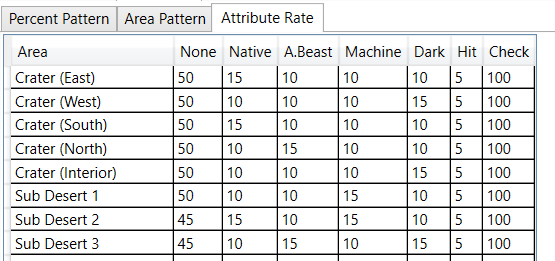

### 属性值信息

* 普通模式会使用Pattern0-4,Pattern5为红盒
* 苦痛模式(Anguish)低级区域使用Pattern3，高级区域使用Pattern4，红盒仍为Pattern5

#### EP1&2&4

#### 商店武器未鉴定和EX信息

镉绿、翠绿、天青、纯蓝和淡紫ID在一些区域掉落未鉴定武器概率稍微提升

#### N

|          |         区域         |                 | 未鉴定概率 | 最高稀有度 |
|:--------:|:--------------------:|:---------------:|:---------------:|:----------------------:|
| Forest 1 |     Temple Alpha     |        -        |       无      |           N/A          |
| Forest 2 |      Temple Beta     |        -        |       无      |           N/A          |
|  Caves 1 |    Spaceship Alpha   |   Crater East   |     17%/17%     |           1★           |
|  Caves 2 |    Spaceship Beta    |   Crater West   |     18%/17%     |           1★           |
|  Caves 3 |     Jungle North     |   Crater South  |     20%/19%     |           1★           |
|  Mines 1 |      Jungle East     |   Crater North  |     19%/18%     |           1★           |
|  Mines 2 |       Mountain       | Crater Interior |     20%/20%     |           1★           |
|  Ruins 1 |     Seaside & CCA    |   Sub Desert 1  |     16%/16%     |           2★           |
|  Ruins 2 |     Seabed Upper     |   Sub Desert 2  |     18%/17%     |           2★           |
|  Ruins 3 | Seabed Lower & Tower |   Sub Desert 3  |     20%/19%     |           2★           |
|          |                      |                 |                 |                        |

#### H

|          |         区域         |                 | 未鉴定概率 | 最高稀有度 |
|:--------:|:--------------------:|:---------------:|:---------------:|:--------------------:|
| Forest 1 |     Temple Alpha     |        -        |     21%/20%     |          2★          |
| Forest 2 |     Temple Beta      |        -        |     21%/20%     |          2★          |
| Caves 1  |   Spaceship Alpha    |   Crater East   |     17%/17%     |          2★          |
| Caves 2  |    Spaceship Beta    |   Crater West   |     18%/18%     |          3★          |
| Caves 3  |     Jungle North     |   Crater South  |     20%/19%     |          2★          |
| Mines 1  |     Jungle East      |   Crater North  |     19%/19%     |          3★          |
| Mines 2  |       Mountain       | Crater Interior |     24%/23%     |          3★          |
| Ruins 1  |    Seaside & CCA     |   Sub Desert 1  |     19%/18%     |          3★          |
| Ruins 2  |     Seabed Upper     |   Sub Desert 2  |     19%/18%     |          3★          |
| Ruins 3  | Seabed Lower & Tower |   Sub Desert 3  |     19%/18%     |          3★          |
|          |                      |                 |                 |                      |

#### VH

|          |         区域         |                 | 未鉴定概率 | 最高稀有度 |
|:--------:|:--------------------:|:---------------:|:---------------:|:--------------------:|
| Forest 1 |     Temple Alpha     |        -        |     21%/21%     |          2★          |
| Forest 2 |      Temple Beta     |        -        |     21%/21%     |          3★          |
|  Caves 1 |    Spaceship Alpha   |   Crater East   |     22%/22%     |          3★          |
|  Caves 2 |    Spaceship Beta    |   Crater West   |     21%/21%     |          3★          |
|  Caves 3 |     Jungle North     |   Crater South  |     22%/22%     |          4★          |
|  Mines 1 |      Jungle East     |   Crater North  |     22%/22%     |          4★          |
|  Mines 2 |       Mountain       | Crater Interior |     22%/22%     |          4★          |
|  Ruins 1 |     Seaside & CCA    |   Sub Desert 1  |     23%/23%     |          4★          |
|  Ruins 2 |     Seabed Upper     |   Sub Desert 2  |     23%/23%     |          4★          |
|  Ruins 3 | Seabed Lower & Tower |   Sub Desert 3  |     23%/23%     |          4★          |
|          |                      |                 |                 |                      |

#### U

|          |         区域         |                 | 未鉴定概率 | 最高稀有度 |
|:--------:|:--------------------:|:---------------:|:---------------:|:--------------------:|
| Forest 1 |     Temple Alpha     |        -        |     22%/21%     |          4★          |
| Forest 2 |      Temple Beta     |        -        |     22%/21%     |          4★          |
|  Caves 1 |    Spaceship Alpha   |   Crater East   |     25%/24%     |          4★          |
|  Caves 2 |    Spaceship Beta    |   Crater West   |     25%/24%     |          4★          |
|  Caves 3 |     Jungle North     |   Crater South  |     25%/24%     |          4★          |
|  Mines 1 |      Jungle East     |   Crater North  |     28%/27%     |          4★          |
|  Mines 2 |       Mountain       | Crater Interior |     28%/27%     |          4★          |
|  Ruins 1 |     Seaside & CCA    |   Sub Desert 1  |     28%/27%     |          4★          |
|  Ruins 2 |     Seabed Upper     |   Sub Desert 2  |     30%/29%     |          4★          |
|  Ruins 3 | Seabed Lower & Tower |   Sub Desert 3  |     30%/29%     |          4★          |
|          |                      |                 |                 |                      |

### 区域信息

#### N

|                  |         区域         |                 | Patterns |
|:----------------:|:--------------------:|:---------------:|:--------:|
|     Forest 1     |     Temple Alpha     |        -        |   0 N N  |
|     Forest 2     |      Temple Beta     |        -        |   0 N N  |
|      Caves 1     |    Spaceship Alpha   |   Crater East   |   0 N N  |
|      Caves 2     |    Spaceship Beta    |   Crater West   |   1 0 N  |
|      Caves 3     |     Jungle North     |   Crater South  |   1 0 N  |
|      Mines 1     |      Jungle East     |   Crater North  |   1 0 N  |
|      Mines 2     |       Mountain       | Crater Interior |   1 0 N  |
|      Ruins 1     |     Seaside & CCA    |   Sub Desert 1  |   2 1 N  |
|      Ruins 2     |     Seabed Upper     |   Sub Desert 2  |   2 1 N  |
|      Ruins 3     | Seabed Lower & Tower |   Sub Desert 3  |   2 1 0  |
| Rares (Anywhere) |                      |                 |   5 5 5  |

#### H

|                  |         区域         |                 | Patterns |
|:----------------:|:--------------------:|:---------------:|:--------:|
|     Forest 1     |     Temple Alpha     |        -        |   1 0 N  |
|     Forest 2     |      Temple Beta     |        -        |   1 0 N  |
|      Caves 1     |    Spaceship Alpha   |   Crater East   |   1 1 N  |
|      Caves 2     |    Spaceship Beta    |   Crater West   |   2 1 N  |
|      Caves 3     |     Jungle North     |   Crater South  |   2 1 1  |
|      Mines 1     |      Jungle East     |   Crater North  |   2 1 1  |
|      Mines 2     |       Mountain       | Crater Interior |   2 2 1  |
|      Ruins 1     |     Seaside & CCA    |   Sub Desert 1  |   3 2 1  |
|      Ruins 2     |     Seabed Upper     |   Sub Desert 2  |   3 2 1  |
|      Ruins 3     | Seabed Lower & Tower |   Sub Desert 3  |   3 3 2  |
| Rares (Anywhere) |                      |                 |   5 5 5  |

#### VH

|                  |         区域         |                 | Patterns |
|:----------------:|:--------------------:|:---------------:|:--------:|
|     Forest 1     |     Temple Alpha     |        -        |   2 1 1  |
|     Forest 2     |      Temple Beta     |        -        |   2 2 2  |
|      Caves 1     |    Spaceship Alpha   |   Crater East   |   2 2 2  |
|      Caves 2     |    Spaceship Beta    |   Crater West   |   3 2 2  |
|      Caves 3     |     Jungle North     |   Crater South  |   3 3 2  |
|      Mines 1     |      Jungle East     |   Crater North  |   3 3 3  |
|      Mines 2     |       Mountain       | Crater Interior |   3 3 3  |
|      Ruins 1     |     Seaside & CCA    |   Sub Desert 1  |   4 3 3  |
|      Ruins 2     |     Seabed Upper     |   Sub Desert 2  |   4 4 3  |
|      Ruins 3     | Seabed Lower & Tower |   Sub Desert 3  |   4 4 4  |
| Rares (Anywhere) |                      |                 |   5 5 5  |

#### U

|                  |         区域         |                 | Patterns |
|:----------------:|:--------------------:|:---------------:|:--------:|
|     Forest 1     |     Temple Alpha     |        -        |   2 1 0  |
|     Forest 2     |      Temple Beta     |        -        |   2 1 0  |
|      Caves 1     |    Spaceship Alpha   |   Crater East   |   2 2 1  |
|      Caves 2     |    Spaceship Beta    |   Crater West   |   3 2 1  |
|      Caves 3     |     Jungle North     |   Crater South  |   3 3 2  |
|      Mines 1     |      Jungle East     |   Crater North  |   3 3 2  |
|      Mines 2     |       Mountain       | Crater Interior |   3 3 3  |
|      Ruins 1     |     Seaside & CCA    |   Sub Desert 1  |   4 3 3  |
|      Ruins 2     |     Seabed Upper     |   Sub Desert 2  |   4 4 3  |
|      Ruins 3     | Seabed Lower & Tower |   Sub Desert 3  |   4 4 4  |
| Rares (Anywhere) |                      |                 |   5 5 5  |

### 属性信息

#### EP1

#### EP2

#### EP4

