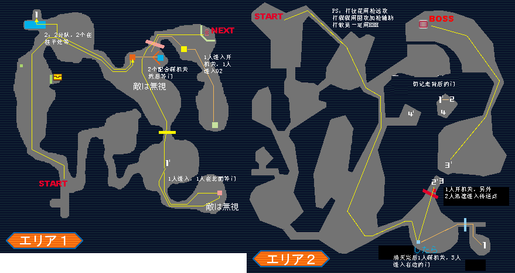
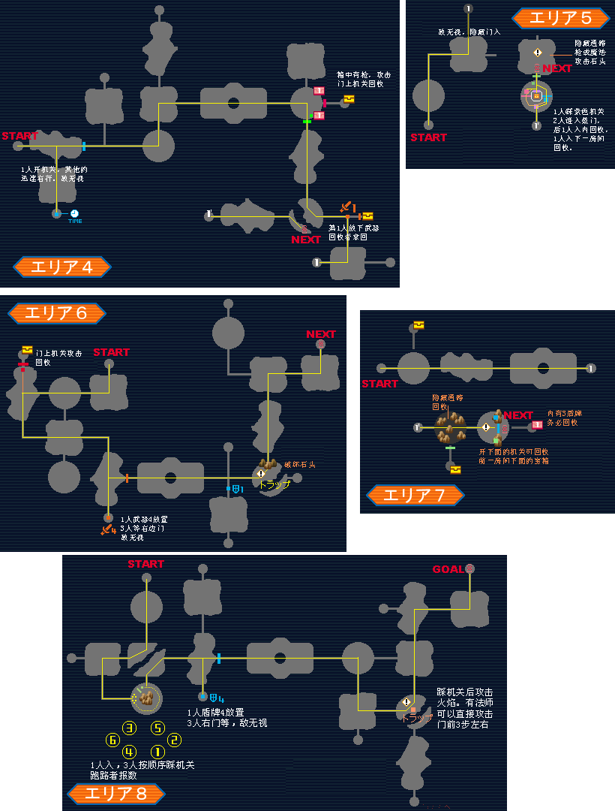
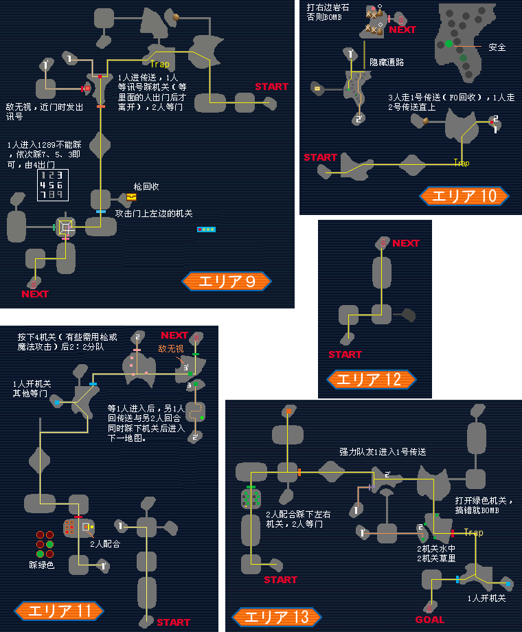
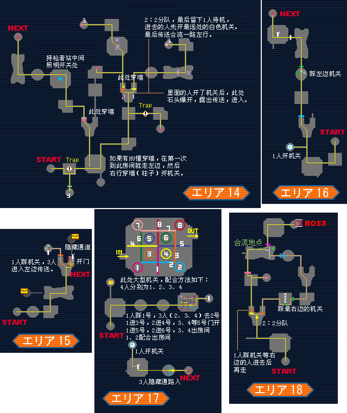
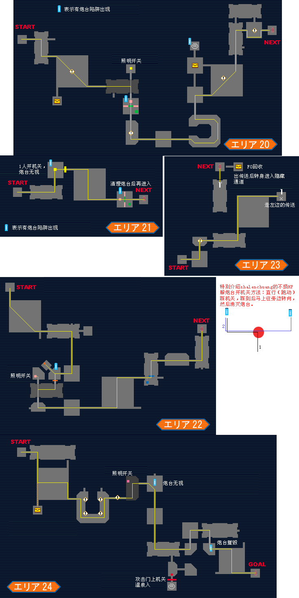
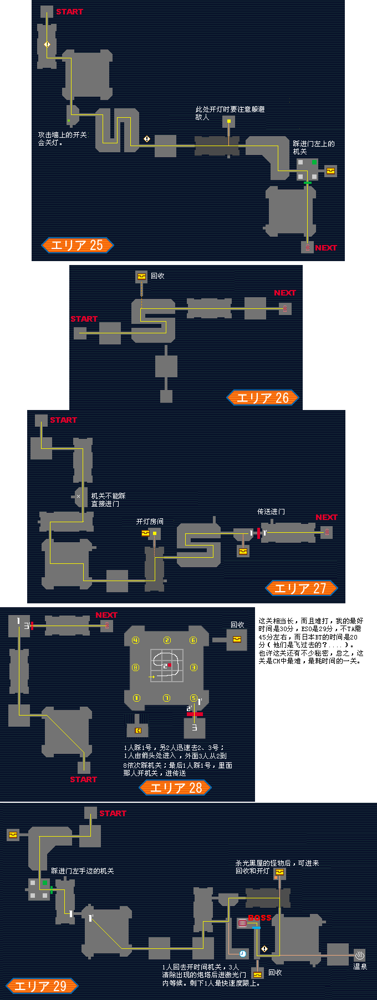
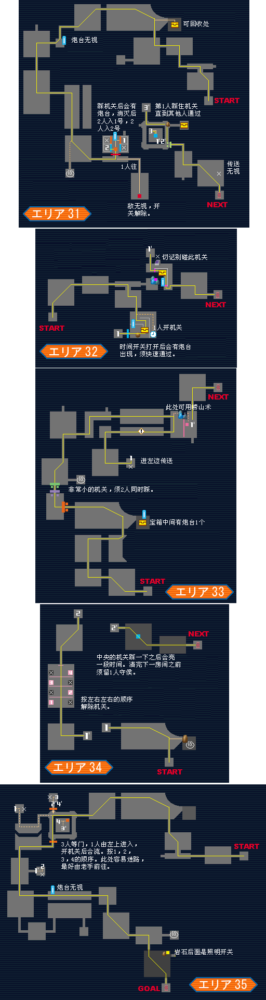
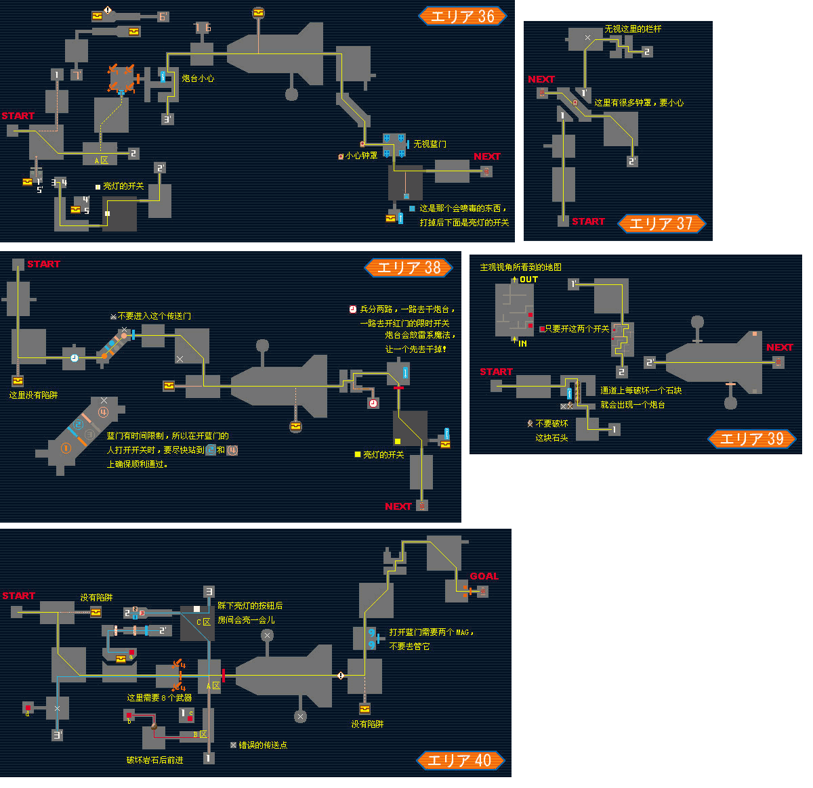
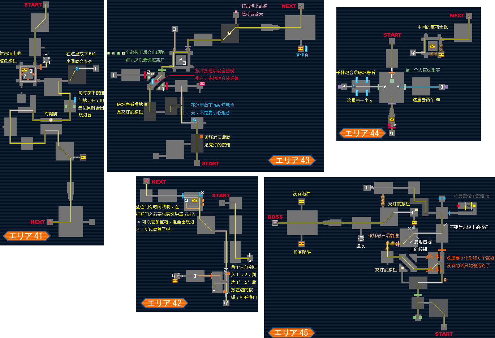

# ep1 挑战模式

## C1
没什么好说的，只要严格按照HUC对每个怪的打法来打，并且不要陷入包围，不要重复打怪，过C1是绝对没有问题的。  

## C2
HUC的miss地狱，初期为N-DN-DH，后期可以采用NHH。翼龙和螳螂优先考虑，最好有专门的HUC负责翼龙。有FO在的话，花就交给FO了，  
HUC绝对不要打，除非FO离花很远并且你已经空闲。HUC的全部替身娃娃都给FO。回收由最弱的HUC去做，大剑回收那里3过1留，应该让FO和1个HUC先过进下一区，  
留下一个HUC踩机关让最后一个HUC过，因为FO的攻击力强过HUC。在最后一个区有鬼火出现在房间，FO在门前用火攻击6次就可开门。TA的话只回收+10剑，+5大剑和盾，其他箱子无视。  

## C3
HUC终于可以用大剑了，标准攻击方式NNH，后期或在怪背后时可以考虑NHH，捡到印剑后可用NHH，绿魔鲨可以3连毙命。翼龙还是要有专人负责，  
史莱姆交给有印剑的队友，只有大剑时最好看准时机第1下挥空，第2下用H，不然miss3次就会分裂，浪费时间。新人不熟悉地图的不要乱碰机关，  
不然会扣HP的。第9区大型机关那里1踩3过。FO从这一关开始要给队友加攻。

## C4
关于机关，图已经讲得很明白了，就不罗嗦了，怪物的基本打法和C3相同。2：2分队时FO跟攻击力强的HUC。BOSS蜈蚣用大剑砍，站位要分开，  
避免一击打多人，未爬上来时站在船边可以用大剑砍到船侧面的蜈蚣，有多余的替身娃娃和HP恢复药可以扔在地上供队员急用。

## C5
机忍要群欧，单挑的话很容易被反击，假如捡到高属性的剑就爽了，一下3连就能砍死机忍。FO优先攻击机忍和空中的电爪。  
回收一般最弱的HUC去，FO要随队对付机忍和电爪。黑房间由FO去开灯，有陷阱的机关那里由HUC来。

## C6
不TA的话绕机堡，注意陷阱的位置，不然，药怕是不够的。FO还是要随队对付机忍和电爪，所以回收还是由HUC去吧。大型机关那里3人没人负责相临的2-3个机关，  
1人进去开。养MAG的HUC到后期可以用机枪，用来对付BOSS的柱子很好用，不过屏幕还是无视，打完6个柱子BOSS就任你宰割了。

## C7
出现了头号危险敌人：法师，不优先消灭会让你们吃尽苦头，HUC在C7时命中还不高，推荐用NHH。FO从这关开始可以用圣泉同伴加HP了。HUC砍剑魔参考HUC打怪心得。  
新手最好不要乱碰机关，不然不是害了队友就是自己迷路。崂山术那里是靠空手3连的最后一下后退挤进石头的，所以刚开始的方向要与墙壁或石头成45度角，  
利用最后一击挤一下，然后调整好方向再3连，再挤，一般3次就可穿过，实在不行的话还是规规矩矩地走远路吧。不TA的32区通过有时间限制的门进传送后走光栅内侧，  
也就是箱子的那一测，千万不要从电脑前面经过，不然回收的同志就惨了。

## C8
基本上没什么棘手的怪物，用4HUC要比3HUC+FO感觉要快一点。前2个房间只要集齐3个武器就可以在第2个房间走左边抄近路了，  
最后一个通过4武器机关的人可以利用网络延迟在进门的瞬间拿回武器顺利脱出。新人还是不要乱进传送，跟老手走。  
40区在A区时3：1分队，强力HUC去右边，3人进左边后再2：1分队，然后4人分别开a,b,c,d4个机关A区的红门就打开了。

## C9
讨厌的法师再度回归，HUC用HHH。想走45区的捷径，8武器和8盾必须，要做好回收工作。最后一个区是无法开灯了，摸黑战斗吧。BOSS战时，  
HUC自己只留一个娃娃，其他的都给FO。FO要做好降防工作，然后帮忙队友回复HP。
