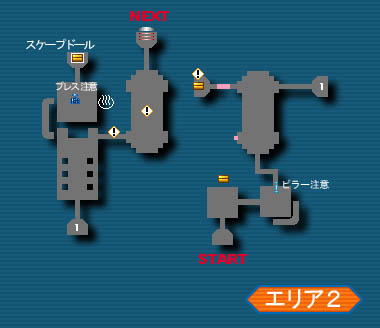
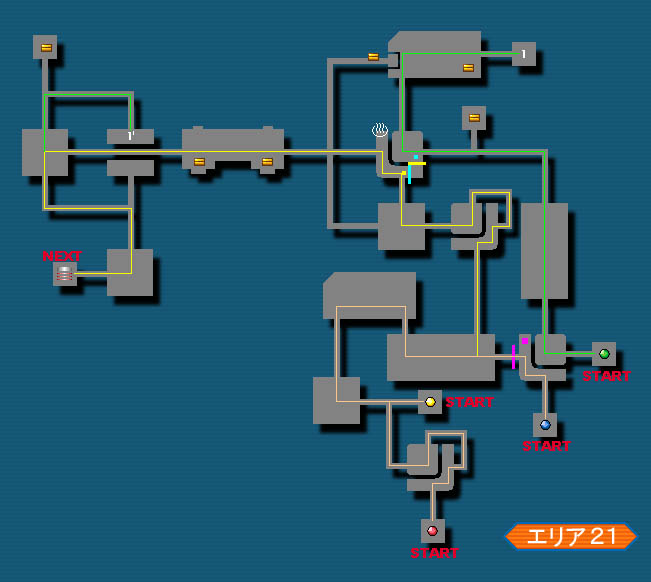

# EP2 挑战模式

首先，EP2 CH的怪物同一般任务一样，是固定的，不存在洗地图一说；熟悉地图以及各个怪的出现位置后，铁皮要灵活运用陷阱；  
玩惯了EP1 CH的要注意，EP2 CH里，很多地方的怪不用打，或者只需要打“看门怪”就可以PASS，所以要改变“见怪就杀”的习惯；  
EP2 CH分头行动的地方非常多，所以一定要具备一定的单兵作战能力；HUcl由于较高的命中，可以使用枪类武器，在部分关卡是不可或缺的角色；   
另外，HUn是EP2 CH中的极品废柴人物，如果不是万不得已，尽量不要使用HUn，以免拖累队友。（尽管如此，GC版仍然有海底37分的超强HUnl存在，一般人还是不要模仿）

## C1:
初始等级LV5，总体而言保留了EP1 CH的风格，流程较长，新手打通大约需要1小时左右。  
基本上，神殿地区没有特别危险的敌人，而且敌人都是老面孔。  
身子板弱的在猩猩和神像旁边要稍微注意一下自己的HP，以免被秒。  

1. 分头行动的地方比较多，这也是EP2 CH的一个特点，所以，要有一定的单兵作战能力，另外，手头最好备一份地图＝ ＝！
2. 神殿危险的不是敌人，而是机关；里面有不少机关类似EP1 C3，新手不懂的还是不要乱开，以免害了队友；
3. AREA2和AREA5有两个娃娃可以回收；
4. AREA6某个拐角处有个石柱（地图左下角往东走的路上），貌似被压了就一击必杀，所以，务必小心！
5. BOSS前可以拣到匕首，如果没有好的武器就用它打BOSS。
6. BOSS战：这个BOSS比较废柴，HP不多，只要小心它上岸时头部的冲撞；全员集中火力砍头就好。（C1好像没见过范围武器可拣）

## C2:  
仍然没有什么难点的关卡（除了BOSS）  

1. 和EP1不同的是，傀儡机器人都有控制器，所以，知道怎么做了吧？
2. 合体兽的防御比EP1低得多，可以直接用剑砍死,想节约时间的引爆混乱陷阱砍，这样不会分开；
3. 本关最烦人的敌人是狼群，数量多，HP也高，加上攻击方式的原因，被包围了很危险，推荐一边砍一边放炎爆陷阱，可以造成较大伤害；
4. 尽量保留所有的魂粉至BOSS，原因就不用说了吧；
5. AREA8合AREA12是冲刺关卡,也就是每个房间都有一个看门怪，只要杀了看门怪就可以前进，所以不要看到怪就打，门开就冲 ；看门怪很好辨认，和杂兵种类不一样的就是了；
6. 本关可以拣到手枪，要灵活运用手枪来引爆陷阱（主要是冰冻）；
7. BOSS战：EP2 CH的第1个难点，新手也许在BOSS前没怎么费HP，但到了BOSS有可能把HP全部用光！所以大家最好在普通模式里先熟悉一下BOSS的行动规律。（本关BOSS之前并不难，所以要尽量保存HP和娃娃）打BOSS前大家最好将魂粉平均分配一下；不要傻乎乎地站在BOSS前方以免被连冰喷死；BOSS腾空，那是要玩地震，经常有新手傻傻地还跑过去，然后自然就是被砸了,－应该往外跑，自己估计一下地板掀起的范围，然后上去砍脚；之后BOSS会飞起来，随机发射冰雷火，这个就完全靠运气躲了！如果不幸被冰冻住，迅速摇杆以解冻并酌情吃药；BOSS咆哮后，会钻地，此时大家应该都集中到地图中央去，待两个BOSS钻出来，不要急着去打，它们会瞬移至中间，接下来就上去开打吧,先飞起来的是真龙（FO一个人电就可以了），其他人随便打比较近的一只，等真龙落地再上去围欧！注意，龙分身后的被攻击判定不在脚上，而是两脚后面一点！另外尽量不要站在龙的前方，加油吧！

## C3:

EP2 CH的难关开始出现！本关的大部分时间和难点就是BOSS战，如果不得要领，此关很可能会让新手彻底郁闷地想砸机器！本关FO当然要有，HUcl也是压时间必备（可以用自动枪）。
注意点：
1. 本关不必恋战，只要打开机关或杀死看门怪走人即可  
2. 本关会遇到3大BOSS，它们都是看门怪，打死就会出现传送门。巨花和蜂王都交给FO用初级魔法单挑，HU去旁边回收或观战，不要打扰！  
巨花，保持一定的距离放小冰即可（如果是绿化或蓝花，自然要换魔法），注意丫被打急了可能会一路压过来，所以要注意逃跑！  
FO打蜂王要注意，丫结茧了就别用小电攻击了，不然一个火球过来就是秒，以防万一，离蜂王远一点再打。  
最后的铁甲牛怕冰，HU嘛站它左手边砍，当然冰冻陷阱引爆后就群欧了！
3. 回收在C3非常重要！  
* AREA16，首先往后走，有几个箱子可回收，FO 1个人去前方单挑巨花，打死巨花，即可进下一层，留一个HU去巨花后面那条小路回收 ，固定出一武器，如果是高属性烙印光剑就爽了！  
* AREA17，强制分组，1P和3P在一边，2P和4P在另一边，两边都有固定箱子可回收，分别是“回复魔法LV3”，“General HP”，2件 “4S SOUL FRAME”。  
FO单挑蜂王时，如果HU们已经回收完毕没事做，那就去砍小蜜蜂，运气好出把鬼武嘛！  
* AREA18，仍然是强制分两组，首先各队都往后跑，都有箱子回收，其中有一个箱子固定一个“General HP”；    
* AREA19，直接就可BOSS战了！看看队伍里有几个HUcl或HUm，因为往反方向跑可以收到2把自动枪，  
依情况派1到2人去回收：一共依次3个大房间，都有传送，下去即可回收。有铁甲牛的那间进传送后直接向前, 踩到地上的亮光会自动将你往前传送至箱子前，  
回收完注意贴着左边缘走，不然可能会踩到地上的隐藏传送！
4. BOSS战：
* 为了避免自己郁闷，以及给队友造成麻烦，请一定先在普通模式好好掌握BOSS的行动、攻击规律！  
* 战斗前分配好防具和药物：FO至少要装备一个General HP（装2个当然是最好，之所以说至少1个是考虑到有可能有2个FO），  
队伍里如果有RA，原则上也需要一个General HP，所以嘛，组队时尽量避免身子板弱的集中在一起（其实还是别用RA的好＝ ＝！）；
* BOSS的强力攻击主要有4个：俯冲，此招一旦爆击连RA都能秒掉，所以FO更要小心了，掌握方法可以完全回避；  
空中降落，此招威力更大， 只要注意BOSS的落点，很容易躲掉；  
奔跑，我记得某HUcl都被爆击秒过，一般注意自己的站位问题并不大，多去普通模式感觉一下吧;  
冲击波：最强的一招，一定范围之内全职业秒杀！主要对近身攻击的HUc威胁较大，使用小冰攻击的FO也要注意逃跑，
用枪的HUcl或RA完全可以在冲击波范围之外从容的射击；  
* 基本打法：  
   刚开战时，所有人站在原地不要动，可以躲过BOSS的第一轮俯冲；接下来BOSS会在空中喷龙卷风，没什么威胁；  
接着BOSS会从场地的边缘使用俯冲，最好的选择是在BOSS之前喷龙卷时，大家迅速移动至场地正中间，等BOSS龙卷喷结束，  
它会向场外飞准备使用俯冲，此时我们应该看准它往外飞的方向，向相反的方向移动，  
（即保证BOSS、自己和场地的圆心在一条直线上，可以打开大地图观察)不用走到版边，  
大概在圆心和边缘中间就可以了（之所以是到这个位置是防止有时候BOSS飞到半径就降落，如果在边缘的话HUc来不及上去砍）。  
这样既可以躲过BOSS的俯冲，也方便一会FO使用辅助魔法；

   BOSS的俯冲一般是从场地一边至另一边（也就是走一个直径），偶尔也会走半径就降落（一般BOSS HP不多时常走半径）；  
如果是直径，躲过俯冲后，大家应该立刻往场地中间靠拢，FO此时使用加攻魔法，等待BOSS降落，注意站位，RA和FO会被一脚塌死！  
BOSS落地后要第一时间攻击:HUc,砍前脚（左脚还是右脚看自己习惯吧＝ ＝！）；能用枪的站远一点，  
在BOSS前方两侧射击头部（之所以不站正前方是因为BOSS有时会发电，前方那就是秒杀！）；FO么就是在中距离用小冰攻击了。  
BOSS落地后有2个行动可能:①趴在地上一动不动，此时当然要全力攻击了，但是要注意，接下来BOSS会起身使用冲击波（有时是奔跑），  
所以，如何估计BOSS的起身时间以提前逃跑就非常重要了！队里如果有老手，自然会适时提醒大家逃跑（就怕网络卡＝ ＝！）；  
②弯腰朝正前方放电，此时FO和用枪的攻击方式不变，HUc就要注意了，别再砍脚了，而是去砍BOSS的头（只有BOSS放电时才能砍到头，头部防御超低）。  
这里需要面对一个问题，如何钻到BOSS下面去砍头？一般JP的做法就是先砍脚，看到BOSS弯腰放电了就从脚的前面绕到头下去砍头，  
但是这个方法比较危险，往往从脚前绕的时候触电身亡，很多人已经对此产生了心理阴影＝ ＝！  
另外有两个保险的方法：一是BOSS落地后，站在BOSS的前脚外侧90度砍（也就是你正对的方向和BOSS正对的方向呈90度），待BOSS脚一动，  
就是说明要发电了，这个时候要赶快往前跑，因为BOSS脚一动的瞬间会露出空隙，可以方便的钻进去至头下，结下来就可以砍头了！  
要注意的是，空隙只有短短一瞬，所以要抓住机会，在之前砍BOSS脚时，往往因为3连收招的问题来不及钻，  
所以最好在BOSS刚落地砍脚时，悠着点，只砍1到2下，确认BOSS不发电了再3连；二是BOSS落地前站它前方，  
然后落地后直接冲到BOSS两条前腿的内侧砍，这样BOSS发电后，只要转个身就能砍头。BOSS发电时，请放心大胆的砍，  
不要担心冲击波问题而提前逃跑，因为发电后，BOSS要么奔跑，要么先趴下然后再冲击波，所以待BOSS停止发电再跑也完全来得及；  
用枪的注意， 由于BOSS是会奔跑的，所以有时候没有好的角度去射头，这时候尽量去射翅膀；  
FO是C3的重中之重，FO使用者的水平高低直接影响战局！首先，FO要注意保命，尽量别被BOSS碰到；  
其次，这个BOSS皮坚肉厚，如果不及时个给BOSS降防，给队友加攻，对BOSS造成的伤害往往是个位数甚至0！  
降防的时机就在BOSS使用俯冲飞过头顶的一瞬，如果错过机会，BOSS落地后也要第一时间补上！  
加攻的时机就是BOSS直径俯冲后，全体聚集在场地中央附近时或BOSS使用半径俯冲前，全体聚集在对面的场地边缘和圆心之间时。  
当然，新手这里面肯定有人乱跑而造成辅助不便，所以，尽量保证辅助主要战斗力（比如老手），尤其是HUc，用枪的因为是射头，  
本身就能造成较大伤害，万一来不及辅助就算！总之还是需要积累经验，队伍里如果有老手带，一定要听他指挥，BOSS在空中发龙卷时时候一定要紧跟着老手！  
初玩C3，BOSS打个半小时以上也是正常，请新手做好心理准备！

关于BOSS的7步倒：在RF时就有人这招TA了，大致上就是BOSS落地后，有时会步行，如果在7步内趴下，那样它在起身后是不会使用地震冲击波的，
所以可以不用逃跑，直接砍。当然这里网络不能卡，不然容易出事！  

## C4:

终于到了EP2 CH最精彩的关卡了！本关对个人实力要求较高，另外本关恶心的陷阱真的很多，强烈要求新手看地图！队伍里如果有老手，一定要虚心听他指挥。
注意点：
1. 本关一开始是兵分4路，而1P在第1层几乎全程单人作战，所以建队伍时注意，让有经验或实力强者做队长（FO不要做1P，不然将浪费很多TP）  
另外1P在海底第1层是可以通过BUG在2光武处下到其它队友那条路线的，很多人都会了，适合TA用，此处暂不提，4p清理完墨晶之后需等待50秒才可以刷出来光武！

2. 海底最讨厌的敌人不是狗，也不是光武，而是铁箱子！ 箱子和飞出来的娃娃怕火，所以铁皮不要吝啬，一边砍一边放炎爆陷阱吧！  
另外，箱子是分吐娃娃和不吐娃娃的，每进一个房间，先观察哪些是吐娃娃的“活箱子”，灭之即可开门，不要浪费时间在“死箱子”上！ 

3. 几种敌人的打法：(1)章鱼：不管是HUc还是HUcl，直接NNH无限连，不用延迟。一轮3连击后立刻接下一轮，找到感觉即可！  
遇到一群当然是放混乱了；(2)盘子：此怪回避超高，单挑的方法就是先等它露头，然后放冰冻，HHN循环，至冰冻引爆，全力攻击！  
HHN的目的是故意让前2下MISS，这样第3下N只要不是爆击，盘子是不会缩回去的；如果有枪可用，就直接引爆陷阱；  
(3)光武，配合陷阱单手剑攻击，1挑2时比较危险，万一被它冻住要赶快摇杆挣脱，不然2个老拳你就浮云了！  
在光武被冰冻前，要酌情使用2连或3连，因为有时候3连过后会被反击，这主要靠经验来判断了；  
(4)狗狗：只有2只狗狗需要硬拼，没有好的办法，只能冰冻群欧之！其余有高低差地形，可以卡着打；  
(5)暗腐蝶：C4没有一只暗腐蝶需要杀，直接无视（当然如果你拣到即死武器可以酌情去秒它），很多场景暗腐蝶的光线攻击可以利用高低差躲过；  
再次强调，炎爆陷阱在海底对大多数敌人有奇效，除了箱子，在冰冻盘子、光武时也可放炎爆提高灭敌效率，尽管GF的陷阱不够充足，但是仍然要多多利用。

4. FO和RA永远不要冲在最前面，除非你对地图很熟悉，不然某只狗狗冲出来基本就秒了；AREA22有道门打开，进去后会冲出一只狗，  
这里交由一个铁皮上去引顺便丢个冰冻，其余人在门外等（FO千万别进去，撞一下几是死！）等狗狗被冻住，全员立刻冲过去！  

5. AREA22和AREA26有2个娃娃可回收；   

6. 海底开始出现看不到的隐藏传送，传送地点将是恐怖至极的炼狱场，什么怪物都有，所以千万不要被这些害人的传送给阴了！    
AREA23有一处，一般老手到这个地方会招呼大家一起站到安全的位置上；AREA26经常出现一道光栅将道路一分为二的，    
这里头一边是安全通道，一边是有隐藏传送的；如果你有地图，知道走哪边还好；万一不知道怎么走，那就打开菜单 ，    
随便挑一边冲过去，绝对安全（这些隐藏传送类似于陷阱，打开菜单就可以过）。记住，千万别被传了，不然害人害己！  

7. BOSS战：大叔么，事实上比暗黑佛还要容易！第1形态不难，唯一要注意的就是FO尽量不要站在大叔的右手前面，因为它的气功斩威力较大，
很容易把FO秒了（所以同EP1 C9一样，有HP药尽量留给FO吃）。有手枪的话比较有效率，HUc如果装不了手枪，机枪、投刃也要用上。
大叔飞一阵会靠近平台，这个时候是攻击他的大好时机，可以直接用剑砍！第2形态，本身也不难，但是战局往往比较混乱，
尤其是大叔经常往地上丢陷阱，碰上的话很恶心，所以要注意躲避！第2形态大叔的攻击模式，  
基本上：一开始，原地不动，这时候当然是上去狂K了，砍脚；然后大叔会开始走动  
注意，之前砍大叔脚的，会被踢倒，FO要注意及时给大家回复和加攻，因此大家也要注意不能乱跑，  
围着大叔转好方便FO辅助（当然也不能过分依赖FO，该吃药还是得吃！）大叔走动一会，就会停下来摆出弓步，  
准备发气功斩，这时候HU们如果比较自信的，可以不躲，继续砍脚，拼血就拼血吧；大叔发完气功斩后，不是玩天罚就是往一边跳开  
注意，天罚可是一击必杀的，所以，在他发完气功斩后，就要远远地逃开以躲避天罚（被气功斩打倒也不要紧，爬起来照样来得及逃），  
逃跑过程中要留意地上的陷阱，万一碰上被混乱或冰冻了几乎就是死了（所以身上最好留些魂粉），另外BOSS的两个MAG周围也会有天罚，  
所以不仅要远离大叔，还要远离两只MAG（不推荐之前去打MAG，完全浪费战斗力拖延时间）；天罚完毕，继续上去追砍大叔。  
只要打法得当，FO及时辅助，大叔非常简单。由于CH是普通难度，大叔是没有附身这招的。   

以上是普通打法，一般TA的话是没有人用逃跑来躲天罚的,在大叔摆弓步时，直接去砍大叔右脚，这样大叔发气功斩时右脚会踩到你而使你倒地，  
刚好躲过气功斩！起身后，赶快站大叔“右脚跟”后继续砍，因为接下来大叔开始聚气发天罚，他的右脚仍然会踩到你而倒地，而我们可以利用起身的无敌时间躲过天罚！  
这样下面又可以继续进攻，节约不少时间（此招就是拼血，FO的话一定要在旁边及时回复，当然HU该吃药还是得迅速吃！）

另外大叔两次天罚后，第3次就是大跳然后蓄气变换属性,－如果你是用第2种脚后跟打法当然无所谓，如果是新手使用逃跑躲天罚的，  
那看好了第3次大叔发过气功斩后就不用逃跑了，狂砍！

## C5:

比起海底，制御塔反而比较简单，当然要注意一下打法。塔里HU就是上去拼血，FO要及时给大家回复，切记!!  

1. 既然是塔，那么就没什么地图可言！注意塔里的铁箱子，和海底一样，只打会吐娃娃的，其余一概无视，炎爆陷阱对箱子伤害很大，多用。

2. 几个怪的打法：
* 巨花：冰冻加狂砍，注意当巨花缩起脖子开始倒计时时，就是要玩即死了，一定要跑开(即便在巨花倒计时过程中将它冻住，等冰消失了巨花还是会玩即死，要小心)。
* 铁甲牛：冰冻狂砍，冰冻引爆前站它的左手边砍；另外经常有2只一齐出现的，这个尽量引到一起，方便FO用小冰贯 穿攻击；
* 蜂王：没什么好的方法，你要拣到手枪最好，没枪就上去硬拼，FO要注意及时给大家回复；
* 黑花：会喷暗魔法，所以地图上每朵黑花都要有人去砍，以免被它阴了；冰冻陷阱足够的话就放，炎爆陷阱也能对它造成大的伤害，注意这厮会将你的HP吸至1，有时候在3连过程中一个吸血加一个磕头攻击刚好就灭了你，所以要小心； 
* 镰刀男：部分可以卡着让FO用小火烧死；部分可以敌无视；硬拼的话就要冰冻＋群欧了！要小心冲撞，FO基本抗不住那一下！炎爆陷阱对其也有奇效!
* 狗：能卡则卡，不能卡就是冰冻＋群欧！

3. 请行动迅速一点，不要总是拉在后面，很多场面需要人多来配合；

4. 注意东塔4楼和西塔5楼有武器可回收；另外西塔7楼有2个巨人级/攻击可回收;  

5. 东塔5楼，最好大家一起上去，进去之后会看到很多红外线光栅，立刻前冲不要碰到，身后会跳下两只铁甲牛，把它们引出红外线光栅的范围再攻击；  
不然碰到光栅会有很多冰冻和火焰陷阱，很麻烦（万一引出了陷阱要立刻灭之）；

6. 东塔6楼，有很多墙壁，敌人是1只镰刀男，只要FO隔着墙用小火烧就可以了,HU如果想蹭经验外加提高灭敌速度的话，可以在墙这边丢个炎爆＝ ＝!  

7. 东塔8楼一上去就是红绿蓝3朵巨花并排，HU不要怕，一起上去一人一朵！FO注意在身后及时给大家回复。  
8. 东塔9楼：2个镰刀男。首先上楼后全体跑到最左面，这样第1个镰刀男就过不来，由FO用小火灭之；然后HU走后面的传送上去打另一个,－  
注意，FO别急着上去，等HU把镰刀男冻住之后再上去帮忙，不然很容易被冲撞致死！  

9. 东塔顶，小狗一只，FO要注意一上楼立刻跑远，不然就被冲出来的狗秒了！  

10. 西塔是从塔顶往下倒着打的，注意8楼，打完2只铁甲牛后，前后会分别出现2朵巨花，推荐新手先集中到一边灭掉2朵，再去另一边继续；  

11. 一进去，2朵黑花，由于还有箱子挡路，需要从箱子中间挤过去，所以一定要小心别被黑花喷死！集体行动配合最好。  

12. 西塔5楼，一进去先往右移动，目的是为了把下面2只狗卡在边缘；  

13. 西塔3楼，一进去看对面，门已经开了！所以这层不用战斗，甩开步子跑,可是有镰刀男把守的哦，快逃！  

14. 西塔2楼，刚进这层先别急着下去打黑花，在门口稍等，巨花出现，灭之！然后就是一场恶战，后期还有2个镰刀男，自己发挥吧！最后一只狗，FO别被撞死哦。  

15. BOSS战： 其实这个算不上BOSS。首先，BOSS的行动模式大家应该都清楚（别说你没刷过塔）。  
BOSS第一次出现时的颜色，会是随机的“红黄蓝紫”中的一种，然后BOSS变色的顺序按“红、黄、蓝、紫”无限循环；
BOSS每次瞄准、3轮上级火后会分开，护盾在身体周围旋转,-我们在U难度时都是提前钻进去打，
但是这里是普通难度，护盾旋转的范围很小，小到可以碰到与BOSS贴身的玩家。
这里就要注意了：BOSS如果是红色，为火属性，这个不用怕，大家一齐贴身砍，FO小冰，即便被护盾刮到也只是受点伤害，吃药或FO回复即可，  
一般只要武器不是太差，一轮就能搞定BOSS！如果是黄色，那是电属性，进去砍会感电；蓝色，那是冰属性，千万不要上去砍，被护盾刮到就是连冰被秒杀；  
紫色是暗属性，更不要去了！所以攻击这个BOSS的最佳时机就是它为红色时, 还有个特殊的`卡盾`套路，就是在boss盾飘起来的轨道上，利用身体卡着盾的运动，  
一般需要hu去做，可以试试有奇效的！！！。  对于TA的队伍，一进去BOSS就是红色是最高兴的，如果是黄色，也可以去砍，但是很容易就会感电，  
对于TA的队伍当然是抓住一切机会去攻击了，感电了如果没魂粉就退吧（当然像我RP那么好的，昨晚手拿机械70％的P剑去砍黄色BOSS而且居然一次都没感电，直接把BOSS灭了）  

这个BOSS的防御狂高，所以一定要加攻和降防！！！HUcl如果没有P剑还是一边歇着去吧＝ ＝！

以上功略以GC版为依据所写，BB可能稍有出入。

