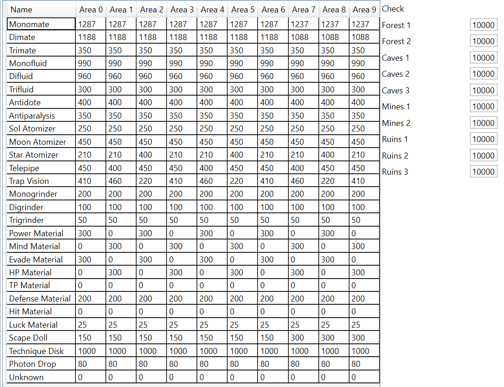
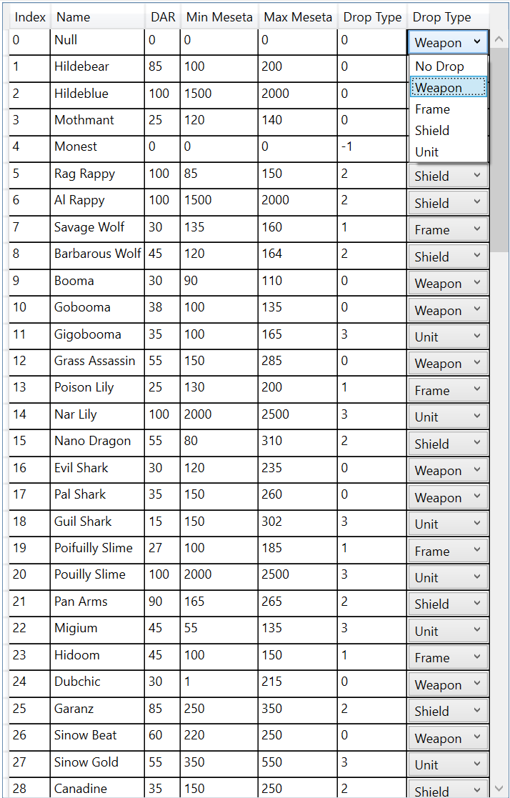

ItemPT(也许是Item Patter Table的缩写)掉落规则表，言外之意就不是稀有掉落的模式，掉落都是一个类型的
这里主要讲的是普通的橙色、绿色、蓝色、梅塞塔等掉落的规则，稀有掉落请直接看掉落表即可。

**ItemPT主要掉落分为3大类，分别是：消耗品Tool、固定模式掉落和梅塞塔**

**消耗品掉落(包括26种，活动时会添加其它道具，保证最终总概率位10000即可):**

* Monomate 小ＨＰ回复液
* Dimate 中ＨＰ回复液
* Trimate 大ＨＰ回复液
* Monofluid 小ＴＰ回复液
* Difluid 中ＴＰ回复液
* Trifluid 大ＴＰ回复液
* Antidote 解毒剂
* Antiparalysis 解痉剂
* Sol Atomizer 魂之粉
* Moon Atomizer 月之粉
* Star Atomizer 星之粉
* Telepipe 传送门
* Trap Vision 陷阱探测器
* Monogrinder 小打磨石
* Digrinder 中打磨石
* Trigrinder 大打磨石
* Power Material 攻击力药
* Mind Material 精神力药
* Evade Material 回避力药
* HP Material ＨＰ药
* TP Material ＴＰ药
* Def Material 防御力药
* Hit Material 命中率药
* Luck Material 运之药
* Scape Doll 替身人偶
* Technique Disk 魔法书
* Photon Drop 光子水晶

**固定掉落(包括5大类):**
* 武器
* 防具
* 盾牌
* 插件
* 空气

