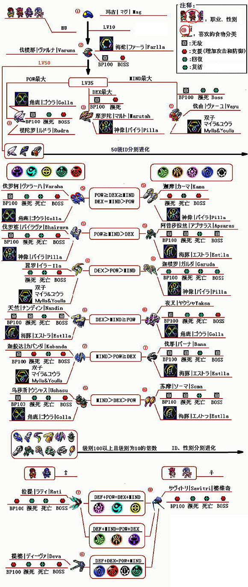
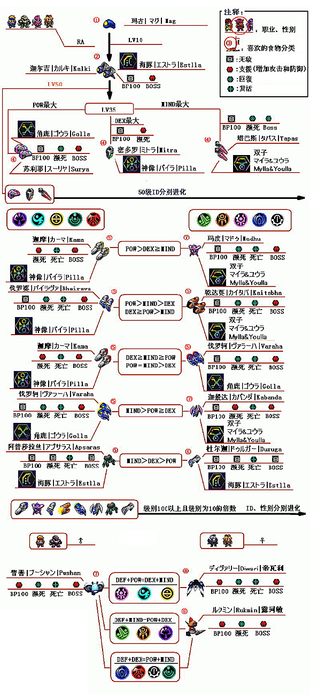
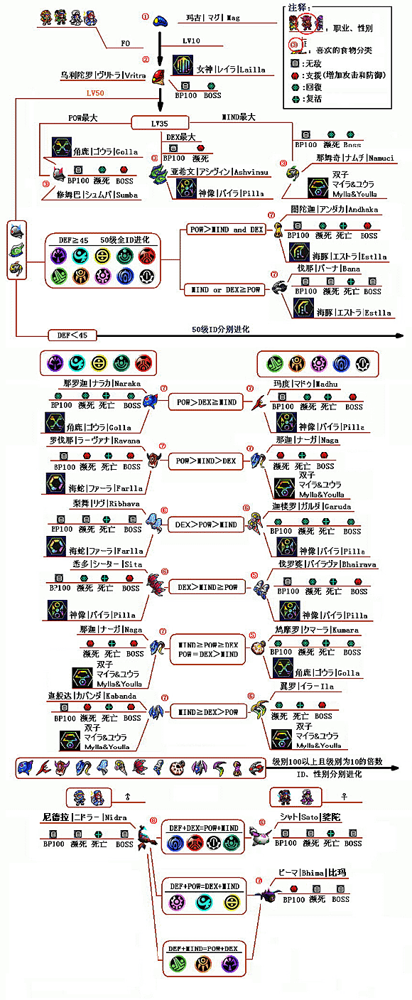

进化图谱: | [战士](#hu) | [枪手](#ra) | [法师](#fo)

食谱: | [0](#recipe1) | [1](#recipe2) | [2](#recipe3) | [3](#recipe4) | [4](#recipe5) | [5](#recipe6) | [6](#recipe7)| [7](#recipe8)

杂项: | [同步率](#sync) | [智力](#iq) | [PB激活条件](#trigger) 

[E服Mag独占颜色](#ephinea_exclusive_mag_colors)

## 战士  
  

## 枪手  
  

## 法师  

---
## 食谱

### 表0 

阶段0: Mag

|      Item     | DEF | POW | DEX | MIND | Synchro | IQ  |
|:---:|:---:|:---:|:---:|:----:|:---:|:---:|
|    Monomate   |  5  |  40 |  5  |   0  |    3    |  3  |
|     Dimate    |  10 |  45 |  5  |   0  |    3    |  3  |
|    Trimate    |  15 |  50 |  10 |   0  |    4    |  4  |
|   Monofluid   |  5  |  0  |  5  |  40  |    3    |  3  |
|    Difluid    |  10 |  0  |  5  |  45  |    3    |  3  |
|    Trifluid   |  15 |  0  |  10 |  50  |    4    |  4  |
|    Antidote   |  5  |  10 |  40 |   0  |    3    |  3  |
| Antiparalysis |  5  |  0  |  44 |  10  |    3    |  3  |
|  Sol Atomizer |  15 |  30 |  15 |  25  |    4    |  1  |
| Moon Atomizer |  15 |  25 |  15 |  30  |    4    |  1  |
| Star Atomizer |  25 |  25 |  25 |  25  |    6    |  5  |

### 表1 

阶段1: Kalki, Varuna, Vrita

|      Item     | DEF | POW | DEX | MIND | Synchro | IQ  |
|:---:|:---:|:---:|:---:|:---:|:---:|:---:|
|    Monomate   |  5  |  10 |  0  |  −1  |    0    |  0  |
|     Dimate    |  6  |  15 |  3  |  −3  |    2    |  1  |
|    Trimate    |  12 |  21 |  4  |  −7  |    3    |  2  |
|   Monofluid   |  5  |  0  |  0  |   8  |    0    |  0  |
|    Difluid    |  7  |  0  |  3  |  13  |    2    |  1  |
|    Trifluid   |  7  |  −7 |  6  |  19  |    3    |  2  |
|    Antidote   |  0  |  5  |  15 |   0  |    0    |  1  |
| Antiparalysis |  −1 |  0  |  14 |   5  |    2    |  0  |
|  Sol Atomizer |  10 |  11 |  8  |   0  |    −2   |  2  |
| Moon Atomizer |  9  |  0  |  9  |  11  |    3    | −2  |
| Star Atomizer |  14 |  9  |  18 |  11  |    4    |  3  |

### 表2 

阶段2: Ashvinau, Namuci, Marutah, Rudra, Sumba

|      Item     | DEF | POW | DEX | MIND | Synchro | IQ  |
|:-------------:|:---:|:---:|:---:|:----:|:-------:|:---:|
|    Monomate   |  1  |  9  |  0  |  −5  |    0    | −1  |
|     Dimate    |  1  |  13 |  0  |  −10 |    3    |  0  |
|    Trimate    |  8  |  16 |  2  |  −15 |    4    |  1  |
|   Monofluid   |  0  |  −5 |  0  |   9  |    0    | −1  |
|    Difluid    |  4  | −10 |  0  |  13  |    3    |  0  |
|    Trifluid   |  6  | −15 |  5  |  17  |    3    |  2  |
|    Antidote   |  −5 |  4  |  12 |  −5  |    −1   |  1  |
| Antiparalysis |  −5 |  −6 |  11 |   4  |    0    |  0  |
|  Sol Atomizer |  0  |  11 |  3  |  −5  |    4    | −2  |
| Moon Atomizer |  4  |  −5 |  0  |  11  |    −1   |  1  |
| Star Atomizer |  7  |  8  |  6  |   9  |    4    |  2  |

### 表3 

阶段2: Mitra, Tapas, Surya

|      Item     | DEF | POW | DEX | MIND | Synchro | IQ  |
|:-------------:|:---:|:---:|:---:|:----:|:-------:|:---:|
|    Monomate   |  0  |  3  |  0  |   0  |    0    | −1  |
|     Dimate    |  5  |  7  |  0  |  −5  |    2    |  0  |
|    Trimate    |  4  |  14 |  6  |  −10 |    3    |  1  |
|   Monofluid   |  0  |  0  |  0  |   4  |    0    |  0  |
|    Difluid    |  4  |  −5 |  0  |   8  |    0    |  1  |
|    Trifluid   |  4  | −10 |  3  |  15  |    2    |  2  |
|    Antidote   |  0  |  0  |  7  |   0  |    −3   |  3  |
| Antiparalysis |  −4 |  −5 |  20 |  −5  |    3    |  0  |
|  Sol Atomizer | −10 |  9  |  6  |   9  |    3    | −2  |
| Moon Atomizer |  8  |  5  |  −8 |   7  |    −2   |  2  |
| Star Atomizer |  7  |  7  |  7  |   7  |    3    |  2  |

### 表4 

阶段2: Vayu

阶段3: Asparas, Bhirava, Kaitabha, Kama, Kumara, Ushasu, Varaha

|      Item     | DEF | POW | DEX | MIND | Synchro | IQ  |
|:-------------:|:---:|:---:|:---:|:----:|:-------:|:---:|
|    Monomate   |  −5 |  9  |  −5 |   0  |    2    | −1  |
|     Dimate    |  0  |  11 |  0  |  −10 |    2    |  0  |
|    Trimate    |  4  |  14 |  0  |  −15 |    0    |  1  |
|   Monofluid   |  −5 |  0  |  −6 |  10  |    2    | −1  |
|    Difluid    |  0  | −10 |  0  |  11  |    2    |  0  |
|    Trifluid   |  4  | −15 |  0  |  15  |    0    |  1  |
|    Antidote   |  −5 |  −5 |  16 |  −5  |    2    | −1  |
| Antiparalysis |  7  |  −3 |  0  |  −3  |    −2   |  3  |
|  Sol Atomizer |  5  |  21 |  −5 |  −20 |    4    | −2  |
| Moon Atomizer |  −5 | −20 |  5  |  21  |    3    |  0  |
| Star Atomizer |  4  |  6  |  8  |   5  |    3    |  2  |

### 表5 

表3: Durga, Garuda, Ila, Nandin, Ribhava, Sita, Soma, Yaksa

表4: Deva, Rukmin, Sato

|      Item     | DEF | POW | DEX | MIND | Synchro | IQ  |
|:-------------:|:---:|:---:|:---:|:----:|:-------:|:---:|
|    Monomate   |  −4 |  13 |  −5 |  −5  |    2    | −1  |
|     Dimate    |  0  |  16 |  0  |  −15 |    0    |  1  |
|    Trimate    |  3  |  19 |  −2 |  −18 |    2    |  0  |
|   Monofluid   |  −4 |  −5 |  −5 |  13  |    2    | −1  |
|    Difluid    |  0  | −15 |  0  |  16  |    0    |  1  |
|    Trifluid   |  3  | −20 |  0  |  19  |    2    |  0  |
|    Antidote   |  5  |  −6 |  6  |  −5  |    0    |  1  |
| Antiparalysis |  0  |  −4 |  14 |  −10 |    −1   |  1  |
|  Sol Atomizer |  4  |  17 |  −5 |  −15 |    4    | −1  |
| Moon Atomizer | −10 | −15 |  5  |  21  |    2    |  0  |
| Star Atomizer |  2  |  8  |  3  |   6  |    3    |  2  |

### 表6 

阶段3: Andhaka, Bana, Kabanda, Madhu, Marica, Naga, Naraka, Ravana

阶段4: Bhima, Pushan, Rati

|      Item     | DEF | POW | DEX | MIND | Synchro | IQ  |
|:-------------:|:---:|:---:|:---:|:----:|:-------:|:---:|
|    Monomate   |  −3 |  9  |  −3 |  −4  |    −1   |  1  |
|     Dimate    |  0  |  11 |  0  |  −10 |    2    |  0  |
|    Trimate    |  2  |  15 |  0  |  −16 |    2    |  0  |
|   Monofluid   |  −3 |  −4 |  −3 |   9  |    −1   |  1  |
|    Difluid    |  0  | −10 |  0  |  11  |    2    |  0  |
|    Trifluid   |  −2 | −15 |  0  |  19  |    2    |  0  |
|    Antidote   |  0  |  6  |  9  |  −15 |    2    | −1  |
| Antiparalysis |  0  | −15 |  9  |   6  |    −2   |  3  |
|  Sol Atomizer |  9  | −20 |  −5 |  17  |    3    | −1  |
| Moon Atomizer |  −5 |  20 |  5  |  −20 |    0    |  2  |
| Star Atomizer |  0  |  11 |  0  |  11  |    3    |  2  |

### 表7 

阶段4: Cell Mags, Diwari, Nidra, Savitri

|      Item     | DEF | POW | DEX | MIND | Synchro | IQ  |
|:---:|:---:|:---:|:---:|:----:|:-------:|:---:|
|    Monomate   |  −4 |  21 | −15 |  −5  |    −1   |  0  |
|     Dimate    |  −1 |  27 | −10 |  −16 |    0    |  1  |
|    Trimate    |  5  |  29 |  −7 |  −25 |    2    |  0  |
|   Monofluid   | −10 |  −5 | −10 |  21  |    −1   |  0  |
|    Difluid    |  −5 | −16 |  −5 |  25  |    0    |  1  |
|    Trifluid   |  −7 | −25 |  6  |  29  |    2    |  0  |
|    Antidote   | −10 | −10 |  28 |  −10 |    −1   |  1  |
| Antiparalysis |  9  | −18 |  25 |  −15 |    2    | −1  |
|  Sol Atomizer |  19 |  18 | −15 |  −20 |    2    |  1  |
| Moon Atomizer | −15 | −20 |  19 |  18  |    2    |  1  |
| Star Atomizer |  3  |  7  |  3  |   3  |    4    |  2  |

---
## 同步率 

影响攻击类PB伤害,最大值120%，死一次减5%

### Mag同步率规则

* +: 基础值+阶梯增幅
* -: 只有阶梯增幅
* 无: 忽略同步率(如果mag技能没有+-，可忽略此项,可参考 [Mags](https://wiki.pioneer2.net/index.php?title=Mags) )

|同步率|概率加成|
|:---:|:---:|
|0-30%|    +0%|
|31-60%| +15%|
|61-80%| +25%|
|81-100%| +30%|
|101-120%| +35%|

---

## 智力 

1. 加血等级，加血是IQ/40下取整等级
2. SD等级，双子是IQ/10, 基础1级，4连81级，PB不满的情况下有%30(60)就够了，200(mag的IQ值), 捐一次10%，捐一次就是2级(200*10%/10=2), 最多3次, 按PB联协数量的倍数贡献SD， 例如:

* 3连PB(一定有双子), 61 + 6 * 3次(单人) = 79级, 61 + 6 * 3次(单人) * 0(人) = 61级
* 2连PB(一定有双子), 41 + 6 * 2次(单人) * 2(人)  = 65级，41 + 6 * 2次(单人) * 1(人) = 53级
* 1PB双子,3捐 21 + 6 * 1次(单人) * 3 = 39级,2捐 21 + 6 * 1次(单人) * 2 = 33级,1捐 21 + 6 * 1次(单人) * 1 = 27级

--- 

## 激活条件 

* 玛古1/10HP激活条件: 角色HP瞬间扣去20%以上(狮鹫羽毛ex21%)并且最终值处于10%以下
* Boss房激活无需解释
* 100PB激活无需解释

---

## E服Mag独占颜色 

<table>
  <tr>
    <th>颜色块</th><th>截图</th><th>名称</th><th>Hex值</th>
  </tr>
  <tr>
    <td></td>
    <td><image src="static/img/Mag_chartreuse-0.png"></image></td>
    <td>Chartreuse</td><td>#7FFF00</td>
  </tr>
  <tr>
    <td></td>
    <td><image src="static/img/Mag_azure-0.png"></image></td>    
    <td>Azure</td><td>#007FFF</td>
  </tr>
  <tr>
    <td></td>
    <td><image src="static/img/Mag_royal_purple-0.png"></image></td>    
    <td>Royal Purple</td><td>#660066</td>
  </tr>
  <tr>
    <td></td>
    <td><image src="static/img/Mag_ruby-0.png" style="width:50px"></image></td>
    <td>Ruby</td><td>#F90505</td>
  </tr>
  <tr>
    <td></td>
    <td><image src="static/img/Mag_sapphire-0.png" style="width:50px"></image></td>
    <td>Sapphire</td><td>#0A0AF2</td>
  </tr>
  <tr>
    <td></td>
    <td><image src="static/img/Mag_emerald-0.png" style="width:50px"></image></td>
    <td>Emerald</td><td>#007F00</td>
  </tr>
  <tr>
    <td></td>
    <td><image src="static/img/Mag_gold-0.png" style="width:50px"></image></td>
    <td>Gold</td><td>#9F7E3A</td>
  </tr>
  <tr>
    <td></td>
    <td><image src="static/img/Mag_silver-0.png" style="width:50px"></image></td>
    <td>Silver</td><td>#8D9BA6</td>
  </tr>
  <tr>
    <td></td>
    <td><image src="static/img/Mag_bronze-0.png" style="width:50px"></image></td>
    <td>Bronze</td><td>#A0654E</td>
  </tr>
  <tr>
    <td></td>
    <td><image src="static/img/Mag_plum-0.png" style="width:50px"></image></td> 
    <td>Plum</td><td>#7F337F</td>
  </tr>
  <tr>
    <td></td>
    <td><image src="static/img/Mag_violet-0.png" style="width:50px"></image></td>
    <td>Violet</td><td>#2B0757</td>
  </tr>
  <tr>
    <td></td>
    <td><image src="static/img/Mag_goldenrod-0.png" style="width:50px"></image></td>
    <td>Goldenrod</td><td>#F2A400</td>
  </tr>
</table>
