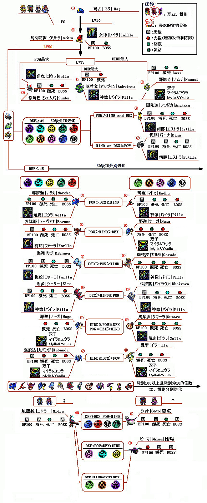

进化图谱: [战士](#hu) [枪手](#ra) [法师](#fo)

食谱: [0](#recipe1) [1](#recipe2) [2](#recipe3) [3](#recipe4) [4](#recipe5) [5](#recipe6) [6](#recipe7) [7](#recipe8)

## 战士  
  

## 枪手  
  

## 法师  
  

## 食谱

Table 0

Stage 0: Mag

|      Item     | DEF | POW | DEX | MIND | Synchro | IQ  |
|:---:|:---:|:---:|:---:|:----:|:---:|:---:|
|    Monomate   |  5  |  40 |  5  |   0  |    3    |  3  |
|     Dimate    |  10 |  45 |  5  |   0  |    3    |  3  |
|    Trimate    |  15 |  50 |  10 |   0  |    4    |  4  |
|   Monofluid   |  5  |  0  |  5  |  40  |    3    |  3  |
|    Difluid    |  10 |  0  |  5  |  45  |    3    |  3  |
|    Trifluid   |  15 |  0  |  10 |  50  |    4    |  4  |
|    Antidote   |  5  |  10 |  40 |   0  |    3    |  3  |
| Antiparalysis |  5  |  0  |  44 |  10  |    3    |  3  |
|  Sol Atomizer |  15 |  30 |  15 |  25  |    4    |  1  |
| Moon Atomizer |  15 |  25 |  15 |  30  |    4    |  1  |
| Star Atomizer |  25 |  25 |  25 |  25  |    6    |  5  |

Table 1

Stage 1: Kalki, Varuna, Vrita

|      Item     | DEF | POW | DEX | MIND | Synchro | IQ  |
|:---:|:---:|:---:|:---:|:---:|:---:|:---:|
|    Monomate   |  5  |  10 |  0  |  −1  |    0    |  0  |
|     Dimate    |  6  |  15 |  3  |  −3  |    2    |  1  |
|    Trimate    |  12 |  21 |  4  |  −7  |    3    |  2  |
|   Monofluid   |  5  |  0  |  0  |   8  |    0    |  0  |
|    Difluid    |  7  |  0  |  3  |  13  |    2    |  1  |
|    Trifluid   |  7  |  −7 |  6  |  19  |    3    |  2  |
|    Antidote   |  0  |  5  |  15 |   0  |    0    |  1  |
| Antiparalysis |  −1 |  0  |  14 |   5  |    2    |  0  |
|  Sol Atomizer |  10 |  11 |  8  |   0  |    −2   |  2  |
| Moon Atomizer |  9  |  0  |  9  |  11  |    3    | −2  |
| Star Atomizer |  14 |  9  |  18 |  11  |    4    |  3  |

Table 2

Stage 2: Ashvinau, Namuci, Marutah, Rudra, Sumba

|      Item     | DEF | POW | DEX | MIND | Synchro | IQ  |
|:-------------:|:---:|:---:|:---:|:----:|:-------:|:---:|
|    Monomate   |  1  |  9  |  0  |  −5  |    0    | −1  |
|     Dimate    |  1  |  13 |  0  |  −10 |    3    |  0  |
|    Trimate    |  8  |  16 |  2  |  −15 |    4    |  1  |
|   Monofluid   |  0  |  −5 |  0  |   9  |    0    | −1  |
|    Difluid    |  4  | −10 |  0  |  13  |    3    |  0  |
|    Trifluid   |  6  | −15 |  5  |  17  |    3    |  2  |
|    Antidote   |  −5 |  4  |  12 |  −5  |    −1   |  1  |
| Antiparalysis |  −5 |  −6 |  11 |   4  |    0    |  0  |
|  Sol Atomizer |  0  |  11 |  3  |  −5  |    4    | −2  |
| Moon Atomizer |  4  |  −5 |  0  |  11  |    −1   |  1  |
| Star Atomizer |  7  |  8  |  6  |   9  |    4    |  2  |

Table 3

Stage 2: Mitra, Tapas, Surya

|      Item     | DEF | POW | DEX | MIND | Synchro | IQ  |
|:-------------:|:---:|:---:|:---:|:----:|:-------:|:---:|
|    Monomate   |  0  |  3  |  0  |   0  |    0    | −1  |
|     Dimate    |  5  |  7  |  0  |  −5  |    2    |  0  |
|    Trimate    |  4  |  14 |  6  |  −10 |    3    |  1  |
|   Monofluid   |  0  |  0  |  0  |   4  |    0    |  0  |
|    Difluid    |  4  |  −5 |  0  |   8  |    0    |  1  |
|    Trifluid   |  4  | −10 |  3  |  15  |    2    |  2  |
|    Antidote   |  0  |  0  |  7  |   0  |    −3   |  3  |
| Antiparalysis |  −4 |  −5 |  20 |  −5  |    3    |  0  |
|  Sol Atomizer | −10 |  9  |  6  |   9  |    3    | −2  |
| Moon Atomizer |  8  |  5  |  −8 |   7  |    −2   |  2  |
| Star Atomizer |  7  |  7  |  7  |   7  |    3    |  2  |

Table 4

Stage 2: Vayu

Stage 3: Asparas, Bhirava, Kaitabha, Kama, Kumara, Ushasu, Varaha

|      Item     | DEF | POW | DEX | MIND | Synchro | IQ  |
|:-------------:|:---:|:---:|:---:|:----:|:-------:|:---:|
|    Monomate   |  −5 |  9  |  −5 |   0  |    2    | −1  |
|     Dimate    |  0  |  11 |  0  |  −10 |    2    |  0  |
|    Trimate    |  4  |  14 |  0  |  −15 |    0    |  1  |
|   Monofluid   |  −5 |  0  |  −6 |  10  |    2    | −1  |
|    Difluid    |  0  | −10 |  0  |  11  |    2    |  0  |
|    Trifluid   |  4  | −15 |  0  |  15  |    0    |  1  |
|    Antidote   |  −5 |  −5 |  16 |  −5  |    2    | −1  |
| Antiparalysis |  7  |  −3 |  0  |  −3  |    −2   |  3  |
|  Sol Atomizer |  5  |  21 |  −5 |  −20 |    4    | −2  |
| Moon Atomizer |  −5 | −20 |  5  |  21  |    3    |  0  |
| Star Atomizer |  4  |  6  |  8  |   5  |    3    |  2  |

Table 5

Stage 3: Durga, Garuda, Ila, Nandin, Ribhava, Sita, Soma, Yaksa

Stage 4: Deva, Rukmin, Sato

|      Item     | DEF | POW | DEX | MIND | Synchro | IQ  |
|:-------------:|:---:|:---:|:---:|:----:|:-------:|:---:|
|    Monomate   |  −4 |  13 |  −5 |  −5  |    2    | −1  |
|     Dimate    |  0  |  16 |  0  |  −15 |    0    |  1  |
|    Trimate    |  3  |  19 |  −2 |  −18 |    2    |  0  |
|   Monofluid   |  −4 |  −5 |  −5 |  13  |    2    | −1  |
|    Difluid    |  0  | −15 |  0  |  16  |    0    |  1  |
|    Trifluid   |  3  | −20 |  0  |  19  |    2    |  0  |
|    Antidote   |  5  |  −6 |  6  |  −5  |    0    |  1  |
| Antiparalysis |  0  |  −4 |  14 |  −10 |    −1   |  1  |
|  Sol Atomizer |  4  |  17 |  −5 |  −15 |    4    | −1  |
| Moon Atomizer | −10 | −15 |  5  |  21  |    2    |  0  |
| Star Atomizer |  2  |  8  |  3  |   6  |    3    |  2  |

Table 6

Stage 3: Andhaka, Bana, Kabanda, Madhu, Marica, Naga, Naraka, Ravana

Stage 4: Bhima, Pushan, Rati

|      Item     | DEF | POW | DEX | MIND | Synchro | IQ  |
|:-------------:|:---:|:---:|:---:|:----:|:-------:|:---:|
|    Monomate   |  −3 |  9  |  −3 |  −4  |    −1   |  1  |
|     Dimate    |  0  |  11 |  0  |  −10 |    2    |  0  |
|    Trimate    |  2  |  15 |  0  |  −16 |    2    |  0  |
|   Monofluid   |  −3 |  −4 |  −3 |   9  |    −1   |  1  |
|    Difluid    |  0  | −10 |  0  |  11  |    2    |  0  |
|    Trifluid   |  −2 | −15 |  0  |  19  |    2    |  0  |
|    Antidote   |  0  |  6  |  9  |  −15 |    2    | −1  |
| Antiparalysis |  0  | −15 |  9  |   6  |    −2   |  3  |
|  Sol Atomizer |  9  | −20 |  −5 |  17  |    3    | −1  |
| Moon Atomizer |  −5 |  20 |  5  |  −20 |    0    |  2  |
| Star Atomizer |  0  |  11 |  0  |  11  |    3    |  2  |

Table 7

Stage 4: Cell Mags, Diwari, Nidra, Savitri

|      Item     | DEF | POW | DEX | MIND | Synchro | IQ  |
|:---:|:---:|:---:|:---:|:----:|:-------:|:---:|
|    Monomate   |  −4 |  21 | −15 |  −5  |    −1   |  0  |
|     Dimate    |  −1 |  27 | −10 |  −16 |    0    |  1  |
|    Trimate    |  5  |  29 |  −7 |  −25 |    2    |  0  |
|   Monofluid   | −10 |  −5 | −10 |  21  |    −1   |  0  |
|    Difluid    |  −5 | −16 |  −5 |  25  |    0    |  1  |
|    Trifluid   |  −7 | −25 |  6  |  29  |    2    |  0  |
|    Antidote   | −10 | −10 |  28 |  −10 |    −1   |  1  |
| Antiparalysis |  9  | −18 |  25 |  −15 |    2    | −1  |
|  Sol Atomizer |  19 |  18 | −15 |  −20 |    2    |  1  |
| Moon Atomizer | −15 | −20 |  19 |  18  |    2    |  1  |
| Star Atomizer |  3  |  7  |  3  |   3  |    4    |  2  |
