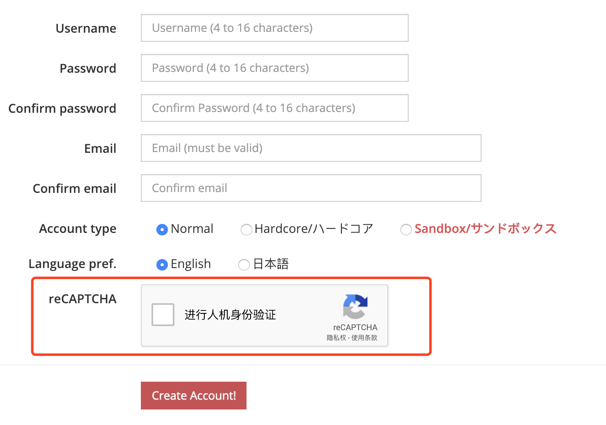
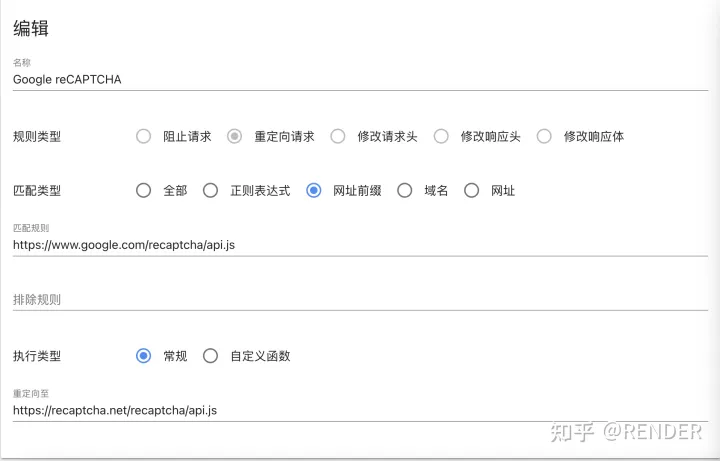
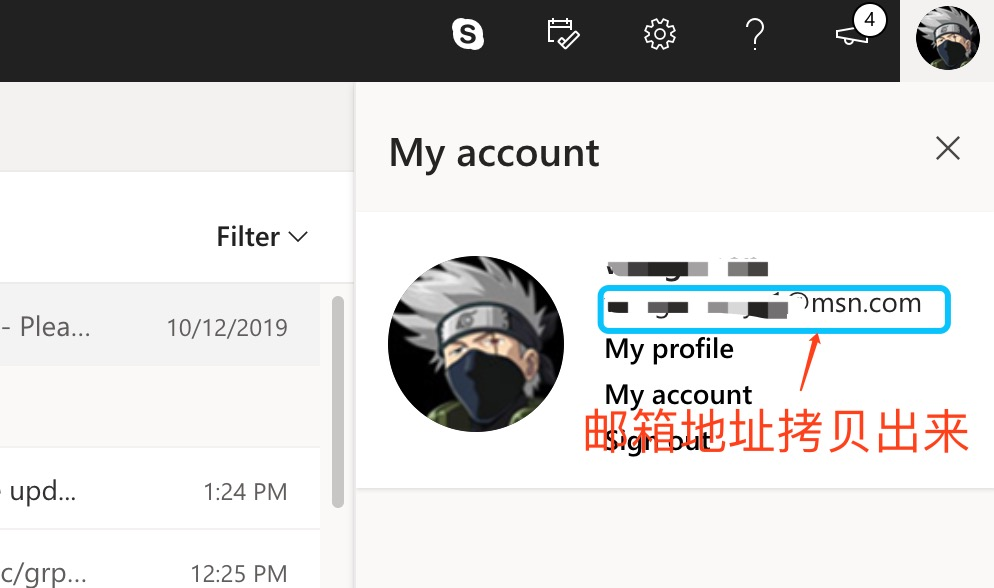

## 账号注册

注册地址：
[账号注册（Ephinea）](https://ephinea.pioneer2.net/register)

**可使用邮箱类型：**
微软邮箱（Outlook / Live / Hotmail 等国际邮箱）。

注册页面内包含 **reCAPTCHA** 验证，需要能够正常访问外网才能显示：


---

## 无法访问 reCAPTCHA 时的解决方案（国内环境）

由于国内无法访问 Google 服务，注册/登录页面中的 reCAPTCHA 可能加载失败。
可以通过安装浏览器扩展，将国外 reCAPTCHA 地址自动重定向为国内镜像：

国外地址：

```
https://www.google.com/recaptcha/api.js
```

国内镜像：

```
https://recaptcha.net/recaptcha/api.js
```

### 步骤一：安装插件

请安装 **Header Editor** 插件：

* Firefox：从此处安装
  [HeaderEditor-4.1.1.xpi](./static/HeaderEditor-4.1.1.xpi)

* Chrome：从此处安装
  [headedit_4.1.1.crx](./static/headedit_4.1.1.crx)

### 步骤二：配置规则

安装完成后，在浏览器工具栏点击插件图标，进入配置界面，
按下图方式新增规则并保存：



---

## 邮箱相关说明

* **微软邮箱注册：**
  [注册微软邮箱](https://signup.live.com)

  注册完成后，可在如下界面查看你的邮箱地址：
  

* **微软邮箱登录：**
  [登录 Outlook](https://login.live.com/login.srf)

* **谷歌邮箱登录：**
  [登录 Gmail](https://mail.google.com)

---

> **温馨提示：**
> 注册完成后，请务必 **登录邮箱并完成激活**，否则账号可能无法正常使用。