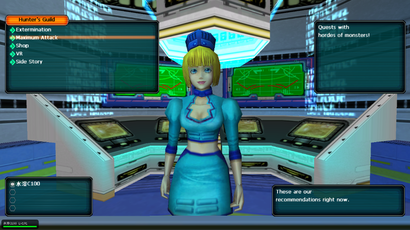
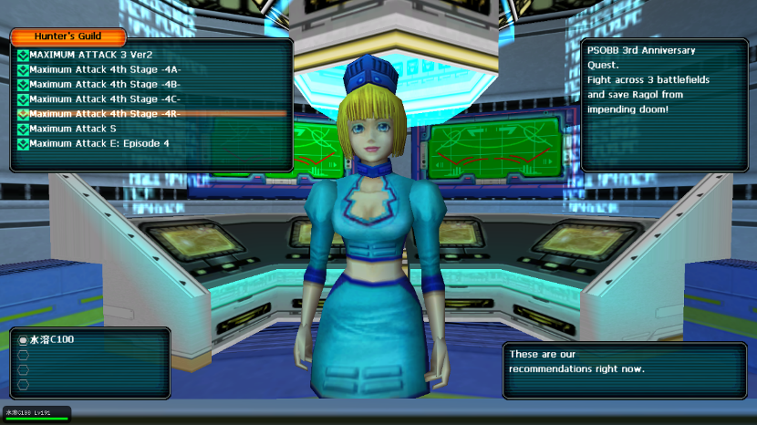
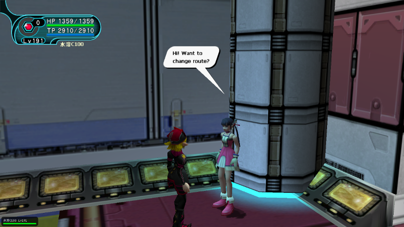
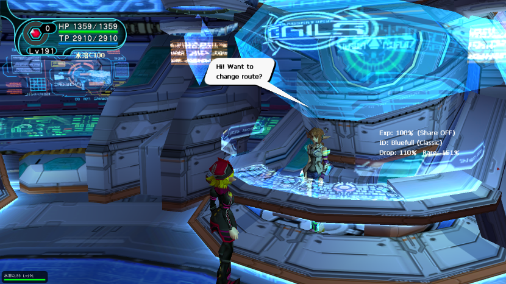
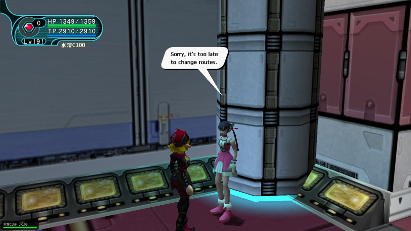
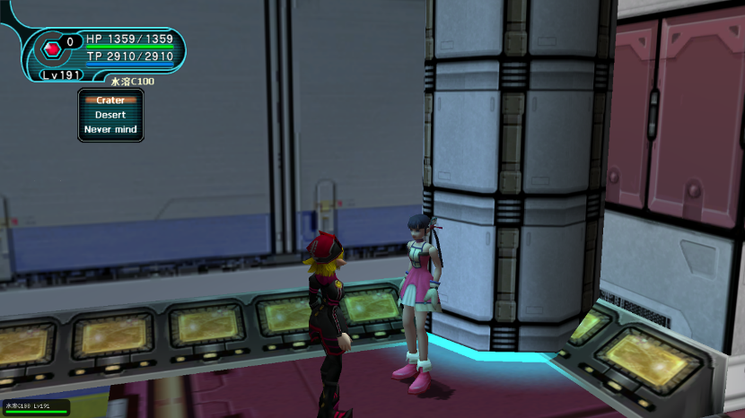
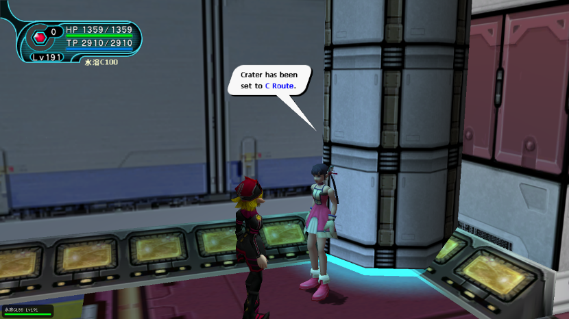
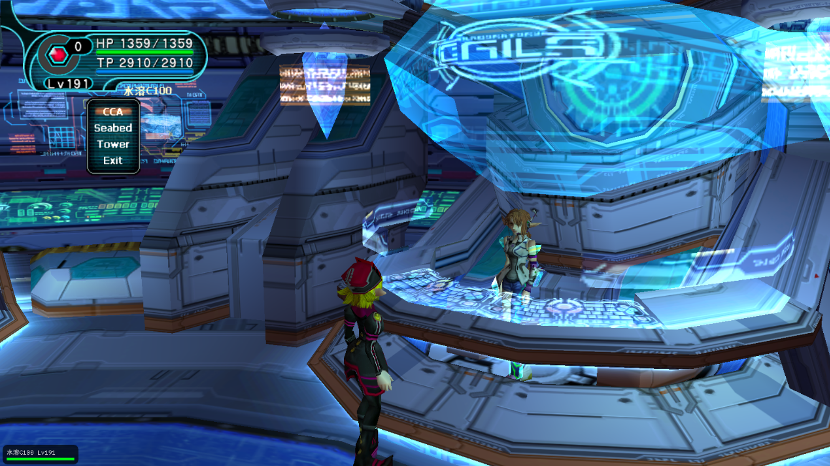

# MAXR任务介绍

**感谢<<肥宅快乐茶(Vita)>>的精彩解说**

就是当玩家开启EP1，EP2，EP4三个章节的普通or单人模式时的这个任务
 

接下来我们1章的简称MA1R，2章的简称MA2R，4章的简称MA4R

只要开启这个任务并且打通关回去交任务，返回大厅后HBR就会提高（还会给MA系列任务的礼品劵，抽奖用，上限255个，爆了会有提示255，留心即可发现）

MAXR任务的路线选择
这个任务有个有趣的地方是野外地图区域是随机拼接的，也有是说有可能上半张地图是A路线，下半张地图是B或C路线，有的时候最后有boss站，有的时候则没有……造成了很多人的迷茫和ID选择纠结，教大家如何选路线：

EP1和EP4都找桃花

 
EP2则是找小秘书Elly
 
两位都会问你“是否要切换路线”。
这里要特别注意，任何人都不要去游戏地图，都在城里等着，任何一个玩家进入野外区域都会将路线变成“完全随机”，如果有人跑太快，NPC就会提示你
 
抱歉，来不及改道了！

下面我们以EP4的MA4R任务为例
 
选择路线的时候，Crater（陨石坑），Desert（沙漠地带）Nevermind表示没事，关闭窗口

我们随便选择一个，比如【陨石坑】
就将会出现 A B C Random 几个选项，假如我们选了其中一个，比如C
NPC就会提示你
  
这个时候如果进入地图，就会立刻生成一张MA系列的战斗地图，其中【陨石坑】部分必定是C路线，而【沙漠地带】是随机路线（ABC都有可能）

然后用EP2举例子，MA2R
   

MA2R包含了3个区域，CCA（中央管理区）Seabed（海底）Tower（塔）
其中，CCA和Seabed都可以设置A，B，C，或者Random，但是Tower，则只有Yes或者No

意思就是【塔】可以设置为“出现”，“不出现”，和“随机出现”

为了快速提高HBR我们肯定会选择尽量快的方式不让塔出现

但是为了刷因子的话我们还是会让塔出现。只要设置好，再进入游戏地图就行。

**注意事项：必须队长来选择路线，选择路线的时候其他人不能进地图！**

推荐方案：

总共有两个方案，思路分别如下：

* 【狂冲HBR】快速提高HBR冲SS，SS高了掉宝率提高好刷浮云！
* 【HBR目标怪两不误】每次都保证ID目标怪正确，我就不信你不出！

如果以【狂冲HBR】为目标，那么ID随意，在路线选择上要选怪少节奏快，能尽快结束的任务，分别如下：

* MA1R：洞窟A坑道C遗迹A （不会遇到佛且怪少）
* MA2R：中央管理区A海底R塔 NO （不会有塔）
* MA4R：陨石坑B 沙漠A（大象极少，路贼近，不会有魔眼巨花Girtab-ruru）

如果以【HBR目标怪两不误】为目标，ID就要慎重选择，路线上要找目标怪和副产率最高的，保证每一次都是丝绸之路才行！以下推荐几个（待补充）

无论任何ID都不推荐刷塔，因为任务太长了，打塔不如直接打PW4

MA1R：

* CCA：金黄 橙黄
* ACC：翠绿 深绿
* RRC：所有掉RR的ID

MA2R：

* ABN：粉红 纯蓝
* CBN/Y：天青 粉红

MA4R：

* BC：粉红 橙黄
* CC：深绿 纯蓝 天青
* CA：天青
